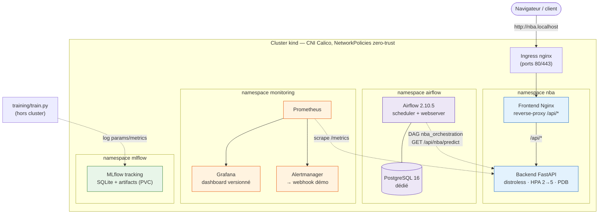

# NBA Predictor — MLOps Pipeline

> Industrialisation cloud-native d'une application ML de classification NBA : conteneurisation, orchestration Kubernetes, automatisation Airflow, observabilité Prometheus/Grafana, sécurité réseau et secrets. Déployable en local sur un cluster [kind](https://kind.sigs.k8s.io/) en une commande.


---

## Pourquoi ce projet

Une application Machine Learning fonctionnelle (modèle entraîné + API + frontend) ne suffit pas pour la production. Ce projet répond à plusieurs questions concrètes d'industrialisation :

- **Conteneurisation** — image distroless, securityContext strict, scan Trivy bloquant
- **Orchestration** — Kubernetes via kind, Kustomize, Helm pour les charts upstream
- **Sécurité** — Secrets via sealed-secrets, NetworkPolicies zero-trust avec Calico
- **Observabilité** — métriques métier + infra, scrape automatique via ServiceMonitor
- **Automatisation** — DAGs Airflow, CI/CD GitHub Actions, Dependabot

Le résultat : un pipeline reproductible, observable, sécurisé et démontrable, représentatif des solutions production.

> **Crédit** — l'application NBA initiale (modèle, API, frontend) est l'œuvre de **Ketsia MULAPI** (juin 2021). La partie industrialisation a été conçue par **Maël M. ZINSOU** en 2026 dans le cadre du cours "Infrastructures et orchestration de données" (YNOV).

---

## Architecture

3 namespaces Kubernetes isolés sur un cluster local [kind](https://kind.sigs.k8s.io/) avec CNI Calico :

| Namespace | Composants | Rôle |
|---|---|---|
| `nba` | Frontend Nginx + Backend FastAPI (distroless) | Application métier |
| `airflow` | Apache Airflow 2.10.5 (Helm, chart pinné) + PostgreSQL 16 dédié | Orchestration des appels API |
| `monitoring` | kube-prometheus-stack (Prometheus + Grafana) | Supervision via ServiceMonitor |



**Flux principaux** :
- **Applicatif** : navigateur → Ingress nginx (`nba.localhost`) → Nginx (reverse-proxy `/api/*`) → FastAPI
- **Orchestration** : DAG `nba_orchestration` → `GET /api/nba/predict` (cross-namespace autorisé)
- **Observabilité** : FastAPI `/metrics` → Prometheus → Grafana / Alertmanager

**Data Engineering** :
- Pipeline d'entraînement reproductible (`training/train.py`, seed fixe, split train/test) qui corrige le bug historique de `preprocess()` (scaler sérialisé) et remplace le modèle sklearn 0.24.1 par un modèle 1.5.1
- Tracking **MLflow** déployé dans le cluster (namespace `mlflow`) : params, métriques, artefacts

**Observabilité** :
- Dashboard Grafana "NBA Predictor — API Overview" **versionné en Git** (provisionné via ConfigMap, pas cliqué à la main) : débit, latence p50/p95/p99, taux d'erreur, replicas
- 4 alertes `PrometheusRule` (latence haute, erreurs 5xx, backend down, HPA saturé) routées vers Alertmanager → receiver webhook de démo

**Sécurité** :
- Image backend en `gcr.io/distroless/python3-debian12:nonroot` (~10 CVE HIGH résiduelles documentées dans `.trivyignore` vs ~250 sur l'image slim)
- Secrets Postgres/Airflow chiffrés via [Bitnami sealed-secrets](https://github.com/bitnami-labs/sealed-secrets) (committable) — `make all` **auto-re-scelle** si la clé du controller change (cluster recréé), garantissant un déploiement from-scratch reproductible
- NetworkPolicies zero-trust : pod intrus dans `default` → backend ou postgres = **timeout effectif**

> Détails techniques complets → [docs/doc.md](docs/doc.md).

---

## Quickstart

### Prérequis

| Outil | Version | Rôle |
|---|---|---|
| [Docker Desktop](https://docs.docker.com/get-docker/) | ≥ 20.10 | Build des images + runtime kind |
| [kind](https://kind.sigs.k8s.io/) | ≥ 0.27 | Cluster Kubernetes local |
| [kubectl](https://kubernetes.io/docs/tasks/tools/) | ≥ 1.28 | Client CLI Kubernetes |
| [Helm](https://helm.sh/) | ≥ 3.12 | Charts Airflow + kube-prometheus-stack + sealed-secrets |
| [GNU Make](https://www.gnu.org/software/make/) | ≥ 4.0 | Orchestration des commandes |
| [kubeseal](https://github.com/bitnami-labs/sealed-secrets) | ≥ 0.27 | Regénération des SealedSecret (optionnel) |

**Ressources Docker Desktop** : 4 CPU, 8 Go RAM minimum.
**Installation par OS** → [docs/PREREQUISITES.md](docs/PREREQUISITES.md).

### Déploiement en une commande

```bash
make all
```

Enchaîne : cluster kind + Calico CNI → build images + chargement kind → sealed-secrets controller → app NBA (Kustomize + NetworkPolicies) → monitoring stack (Helm) → Airflow + Postgres dédié. ~5-10 min au premier run.

### Accès aux UIs

```bash
# Frontend NBA + API via Ingress (V4.5)
open http://nba.localhost
# Pré-requis : ajouter '127.0.0.1 nba.localhost' à /etc/hosts (Linux/macOS)
# ou C:\Windows\System32\drivers\etc\hosts (Windows). Sur systemd-resolved
# récent, *.localhost résout automatiquement.

# Airflow + Grafana (port-forward)
make port-forward-airflow    # http://localhost:8081 (admin/admin)
make port-forward-grafana    # http://localhost:3000 (admin/prom-operator)

# Démo HPA scale-up sous charge (V4.4)
make load-test               # 50 workers x 60s, observer : kubectl get hpa -n nba -w
```

### Cibles utiles

```bash
make help                # liste toutes les cibles disponibles
make status              # état des 3 namespaces
make logs-backend        # streaming des logs backend
make destroy             # supprime workloads (garde le cluster)
make cluster-down        # supprime le cluster kind
```

> Cookbook complet des commandes par vague → [docs/key_commands.md](docs/key_commands.md).

---

## Roadmap

- [x] Portfolio fundamentals (README, LICENSE, CONTRIBUTING)
- [x] Developer experience (Makefile, Kustomize overlays dev/staging/prod)
- [x] Migration Minikube → kind
- [x] CI/CD GitHub Actions (5 jobs lint+test, build Docker GHCR, k8s integration)
- [x] Tests unitaires (pytest) et d'intégration (FastAPI TestClient + kind smoke)
- [x] Secrets K8s via Bitnami sealed-secrets (Postgres + URL SQLAlchemy chiffrés)
- [x] Dockerfile multi-stage distroless + Trivy `--exit-code 1` + securityContext strict
- [x] NetworkPolicies zero-trust + CNI Calico via tigera-operator
- [x] HorizontalPodAutoscaler backend (CPU 70%, min 2 max 5) + metrics-server + load test
- [x] Ingress nginx (`nba.localhost`) + PodDisruptionBudgets backend/frontend
- [x] Dashboard Grafana versionné (ConfigMap) + alertes PrometheusRule routées vers Alertmanager
- [x] Pipeline d'entraînement reproductible (`training/train.py` + MLflow tracking) + fix bug `preprocess()` (scaler sérialisé)
- [x] Serveur MLflow déployé dans le cluster (namespace `mlflow`, SQLite + artifacts sur PVC)
- [x] Test complet de reproductibilité : `cluster-down` + `make all` from-scratch validé de bout en bout (auto-reseal sealed-secrets, Airflow chart pinné 2.10.5)
- [ ] DAG `nba_orchestration` : se déploie/détecte mais scheduling bloqué sur kind local (limite connue, cf. [doc.md §11.7](docs/doc.md))
- [ ] DVC (versionnage dataset) + DAG Airflow d'entraînement batch

---

## Documentation

| Document | Rôle |
| --- | --- |
| [README.md](README.md) (ce fichier) | Pitch, archi, quickstart, roadmap |
| [docs/doc.md](https://www.google.com/search?q=docs/doc.md) | Référence technique profonde : pourquoi des choix, débogage, ADR |
| [docs/key_commands.md](https://www.google.com/search?q=docs/key_commands.md) | Cookbook chronologique : commandes exactes par vague |
| [docs/pour_les_nuls.md](https://www.google.com/search?q=docs/pour_les_nuls.md) | Vulgarisation : pourquoi chaque outil existe, en analogies |
| [docs/PREREQUISITES.md](https://www.google.com/search?q=docs/PREREQUISITES.md) | Install des outils par OS (Windows / macOS / Linux) |
| [docs/Rapport projet orchestra nba_predictor.pdf]() | Rapport rendu pour le cours (V3) |

---

## License

[MIT](LICENSE).

Le code applicatif initial est © Ketsia MULAPI TITA 2021. L'industrialisation est © Maël M. ZINSOU 2026.

---

## Contact

Maël M. ZINSOU — [maelzinsou@proton.me](mailto:maelzinsou@proton.me)
