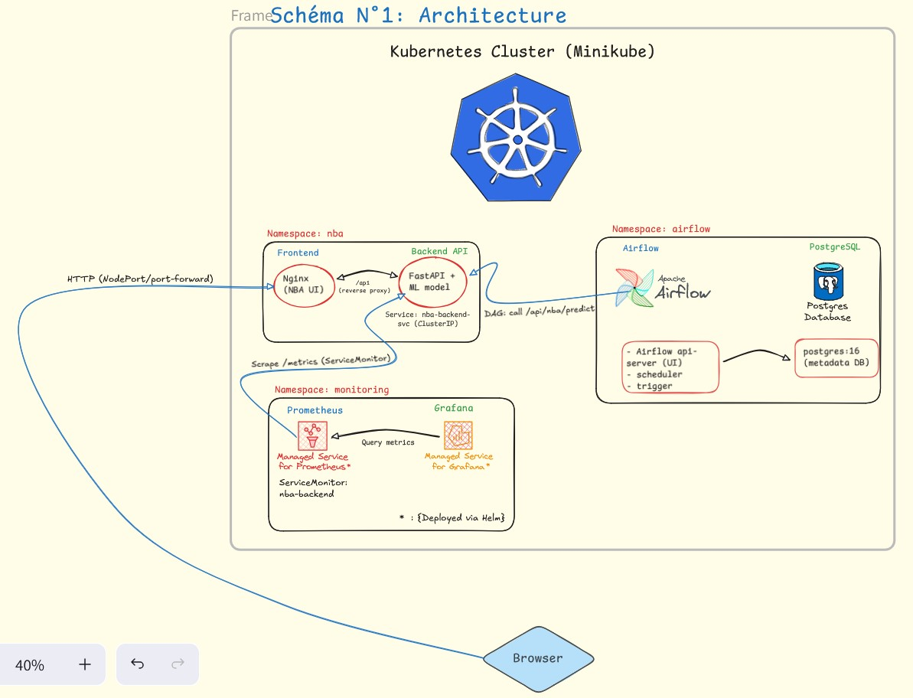
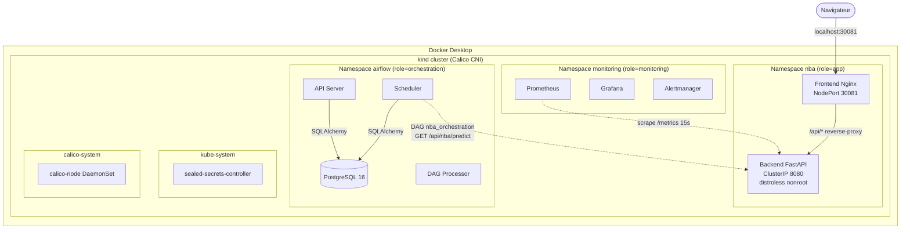
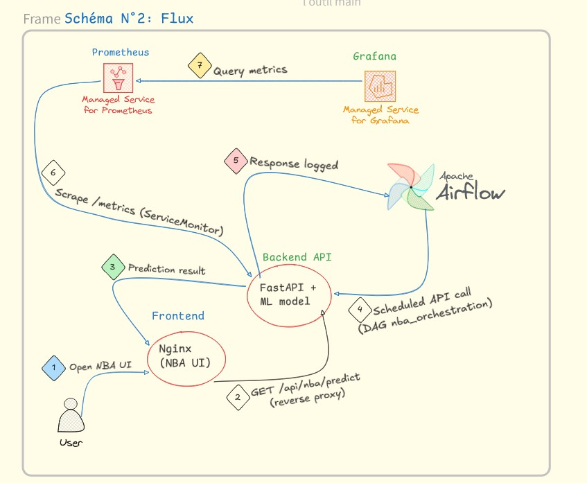
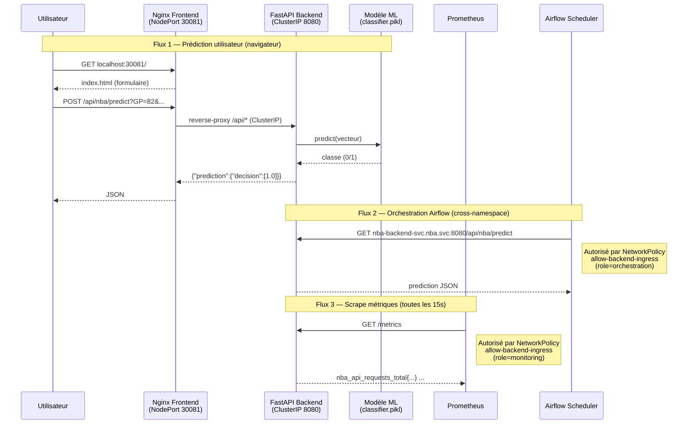
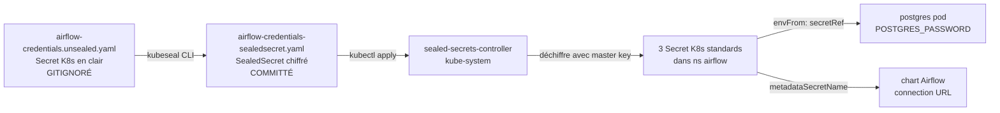
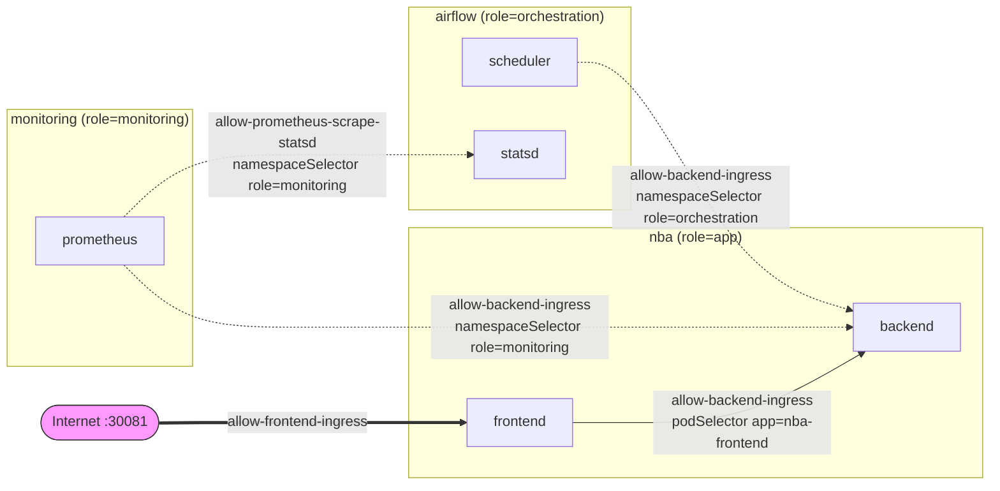

# Documentation technique — NBA Predictor

> Référence approfondie : **pourquoi** chaque choix, **comment** chaque pièce fonctionne, **où** débugger.
> Pour un démarrage en 5 minutes → [README.md](../README.md). Pour reproduire les commandes clés → [key_commands.md](key_commands.md).

---

## Table des matières

- [1. Contexte et auteurs](#1-contexte-et-auteurs)
- [2. Architecture](#2-architecture)
  - [2.1 Vue d'ensemble (3 namespaces)](#21-vue-densemble-3-namespaces)
  - [2.2 Flux de communication](#22-flux-de-communication)
- [3. Stack technique détaillée](#3-stack-technique-détaillée)
- [4. Structure du repository](#4-structure-du-repository)
- [5. Conventions et patterns](#5-conventions-et-patterns)
- [6. Sécurité (Vague 4)](#6-sécurité-vague-4)
  - [6.1 Image distroless (V4.2)](#61-image-distroless-v42)
  - [6.2 SealedSecrets (V4.1)](#62-sealedsecrets-v41)
  - [6.3 NetworkPolicies + Calico (V4.3)](#63-networkpolicies--calico-v43)
  - [6.4 Trivy et politique `.trivyignore`](#64-trivy-et-politique-trivyignore)
- [7. CI/CD GitHub Actions](#7-cicd-github-actions)
- [8. Tests](#8-tests)
- [9. Bugs connus et dette technique](#9-bugs-connus-et-dette-technique)
- [10. Décisions architecturales (mini-ADR)](#10-décisions-architecturales-mini-adr)

---

## 1. Contexte et auteurs

Projet réalisé dans le cadre du cours **"Infrastructures et orchestration de données"** (YNOV, enseignante : Ketsia Mulapi Tita).

- **Application ML d'origine** (modèle de classification de joueurs NBA, API FastAPI, frontend statique) : © Ketsia MULAPI, juin 2021.
- **Partie industrialisation** (conteneurisation, Kubernetes, Airflow, Prometheus/Grafana, CI/CD, sécurité réseau) : © Maël M. ZINSOU, 2026.

Le modèle ML (régression logistique sklearn 0.24.1, sérialisé dans `classifier.pikl`) est **figé** : l'objectif n'est pas le ML mais l'industrialisation. Un pipeline d'entraînement reproductible viendra en Vague 6.

---

## 2. Architecture

### 2.1 Vue d'ensemble (3 namespaces)

L'application tourne sur un cluster Kubernetes local **[kind](https://kind.sigs.k8s.io/)** (Kubernetes-in-Docker), organisé en 3 namespaces isolés :

| Namespace | Composants | Rôle | Label `role=` |
|---|---|---|---|
| `nba` | Frontend Nginx + Backend FastAPI | Application métier | `app` |
| `airflow` | Apache Airflow 3 (LocalExecutor, Helm) + PostgreSQL 16 dédié | Orchestration des appels API | `orchestration` |
| `monitoring` | kube-prometheus-stack (Prometheus + Grafana + Alertmanager + Operator) | Supervision via ServiceMonitor | `monitoring` |

Le label `role=` sur les namespaces permet aux **NetworkPolicies** des autres namespaces de cibler les flux cross-namespace par sélecteur sémantique (voir §6.3).



Le cluster tourne dans Docker Desktop (1 control-plane + 1 worker), avec **Calico** comme CNI pour le support des NetworkPolicies (kindnet, le CNI par défaut, ne les fait pas respecter).



### 2.2 Flux de communication

Trois flux principaux, tous testables :





**Routes API exposées** :
| Méthode | Path | Description |
|---|---|---|
| `GET` | `/` | Healthcheck minimal |
| `GET` | `/api/nba/predict?GP=...&PTS=...&...` | Prédiction depuis 19 stats individuelles |
| `GET` | `/api/nba/info?Name=<nom>` | Prédiction depuis le nom (lookup dans le CSV de référence) |
| `POST` | `/api/nba/dataset` | Prédictions vectorisées sur un CSV uploadé |
| `GET` | `/metrics` | Exposition Prometheus (Counter + Histogram) |
| `GET` | `/docs` | OpenAPI Swagger UI (FastAPI auto-généré) |

---

## 3. Stack technique détaillée

| Composant | Choix | Version | Justification |
|---|---|---|---|
| Conteneurisation | **Docker Desktop** | ≥ 20.10 | Isolation dev/prod, host des conteneurs kind, intégration WSL2 |
| Cluster local | **[kind](https://kind.sigs.k8s.io/)** | ≥ 0.27 | Kubernetes-in-Docker, plus rapide que Minikube, conteneurs visibles dans Docker Desktop |
| Image node kind | `kindest/node:v1.32.2` | pinned SHA | v1.35 a un bug kubeadm/API v1beta3 ([kind#3994](https://github.com/kubernetes-sigs/kind/issues/3994)) |
| CNI | **[Calico](https://www.tigera.io/project-calico/)** via tigera-operator | v3.28.2 | Supporte NetworkPolicies (kindnet par défaut ne les respecte pas) |
| Backend | **FastAPI** + scikit-learn | 0.115.6 / 1.5.1 | Performance async, doc OpenAPI auto, Prometheus client natif |
| Backend image | **`gcr.io/distroless/python3-debian12:nonroot`** | Python 3.11.2 | Pas de shell ni d'apt, UID 65532, surface d'attaque drastiquement réduite |
| Frontend / Reverse proxy | **Nginx** | 1.31 (alpine) | Statique performant, élimine les problèmes CORS, single entry point |
| Orchestration | **Apache Airflow 3** (Helm) | LocalExecutor | Standard pour DAGs, logs UI, dag-processor découplé |
| Base métadonnées Airflow | **PostgreSQL 16** dédié | image officielle | Robuste, déployé séparément du chart Airflow (subchart instable) |
| Secrets | **Bitnami sealed-secrets** | controller via Helm | SealedSecret committable, déchiffrement côté cluster uniquement |
| Métriques | **Prometheus** (kube-prometheus-stack) | helm chart 85.x | Scraping auto via ServiceMonitor (label `release: kube-prom`) |
| Dashboards | **Grafana** | bundled dans kube-prom | Visualisation infra + métriques métier |
| Sécurité images | **Trivy** (apt install) | latest stable | Scan HIGH/CRITICAL, exit-code 1 + `.trivyignore` documenté |
| Lint Python | **Ruff** (lint + format) | 0.7.4 | Remplace black + isort + flake8, ultra-rapide |
| Type-check Python | **Mypy** | 1.13.0 | Mode strict sur `nba-api/` et `dags/` |
| Tests | **Pytest** + httpx (TestClient) | 8.3.3 | 33 tests (17 unit + 15 intégration FastAPI + 1 xfail strict bug `preprocess()`) |
| CI/CD | **GitHub Actions** | 3 workflows | `ci.yml`, `docker.yml`, `k8s-integration.yml` + Dependabot |
| Pre-commit | **pre-commit hooks** | 4.0.1 | Ruff, yamllint, hadolint, detect-secrets (aligné CI) |

---

## 4. Structure du repository

```
nba_predictor/
├── nba-api/                          # Backend FastAPI + modèle ML
│   ├── app.py                        # Routes FastAPI + métriques Prometheus
│   ├── functions.py                  # Classe NBAPredictor (modèle + preprocessing)
│   ├── requirements.txt              # Pinned : fastapi 0.115.6, sklearn 1.5.1, ...
│   ├── Dockerfile                    # Multi-stage distroless (V4.2)
│   ├── .dockerignore
│   └── static/
│       ├── model/classifier.pikl     # Modèle sérialisé (sklearn 0.24.1, à régénérer en V6)
│       └── data/nba_logreg.csv       # Dataset de référence pour predict_by_name
├── nba-web/                          # Frontend statique
│   ├── index.html                    # Bootstrap + jQuery, chemins relatifs /api/*
│   ├── nginx.conf                    # Reverse-proxy /api/* → nba-backend-svc:8080
│   └── Dockerfile                    # nginx:alpine, static files only
├── k8s/                              # Manifestes Kubernetes (Kustomize)
│   ├── base/                         # Manifestes communs à tous les overlays
│   │   ├── namespace.yaml            # ns nba (labels : role=app, part-of)
│   │   ├── backend-deployment.yaml   # securityContext strict (V4.2)
│   │   ├── backend-service.yaml      # ClusterIP (depuis V4.3)
│   │   ├── backend-servicemonitor.yaml  # Pour Prometheus (label release: kube-prom)
│   │   ├── frontend-deployment.yaml
│   │   ├── frontend-service.yaml
│   │   ├── networkpolicies-nba.yaml          # V4.3 : default-deny + allows
│   │   ├── networkpolicies-airflow.yaml      # V4.3
│   │   ├── networkpolicies-monitoring.yaml   # V4.3
│   │   ├── airflow-credentials-sealedsecret.yaml  # V4.1 : 3 SealedSecret committés
│   │   └── kustomization.yaml
│   ├── overlays/
│   │   ├── dev/                      # Overlay local
│   │   │   ├── frontend-nodeport.yaml         # NodePort 30081
│   │   │   ├── image-pull-policy-never.yaml   # Images chargées via kind load
│   │   │   └── kustomization.yaml
│   │   ├── staging/                  # Stub README pour pré-prod (HPA, Ingress, etc.)
│   │   └── prod/                     # Stub README pour prod managée (GKE/EKS/AKS)
│   ├── secrets/
│   │   └── airflow-credentials.unsealed.yaml  # GITIGNORÉ — source en clair pour kubeseal
│   ├── kind-config.yaml              # Cluster kind (1 cp + 1 worker, port 30081, disableDefaultCNI)
│   ├── calico-installation.yaml      # CR Installation + APIServer pour tigera-operator
│   └── airflow-postgres.yaml         # Postgres dédié (envFrom: secretRef SealedSecret)
├── dags/                             # DAGs Airflow
│   └── nba_orchestration.py          # Appel quotidien GET /api/nba/predict
├── airflow-values.yaml               # Values Helm (LocalExecutor, metadataSecretName)
├── tests/                            # Suite pytest
│   ├── conftest.py                   # cwd → nba-api/, sys.path injecté
│   ├── test_predictor.py             # 17 tests unit (dont 1 xfail strict bug preprocess)
│   └── test_api.py                   # 15 tests intégration FastAPI TestClient
├── docs/
│   ├── doc.md                        # ← ce fichier
│   ├── key_commands.md               # Cookbook chronologique des commandes
│   ├── PREREQUISITES.md              # Install par OS (Win/macOS/Linux)
│   ├── Rapport projet orchestra nba_predictor.pdf
│   ├── architecture_excalidraw.jpg
│   └── flux_excalidraw.jpg
├── .github/
│   ├── workflows/
│   │   ├── ci.yml                    # 5 jobs parallèles (lint, test, yaml, k8s-validate, hadolint)
│   │   ├── docker.yml                # Build + Trivy --exit-code 1 + SARIF + push GHCR
│   │   └── k8s-integration.yml       # kind + Calico + apply + smoke tests via 30081
│   └── dependabot.yml                # MAJ hebdo, majors pip/docker ignorés (V4.1bis cleanup)
├── Makefile                          # Orchestration (make help pour la liste)
├── pyproject.toml                    # Ruff + Mypy + Pytest config
├── requirements-dev.txt              # Dev/CI deps (ruff, mypy, pytest, pre-commit, etc.)
├── .pre-commit-config.yaml
├── .secrets.baseline                 # detect-secrets : hashes uniquement
├── .trivyignore                      # CVE acceptées avec Revisit by: date
├── .gitignore                        # *.unsealed.yaml, secrets, caches, etc.
├── CLAUDE.md                         # Index + contraintes pour Claude (assistant IA)
├── README.md                         # Vitrine (quickstart, roadmap, liens)
└── LICENSE                           # MIT
```

---

## 5. Conventions et patterns

### 5.1 Workflow images avec kind

```bash
docker build -t nba-backend:1.2 ./nba-api   # build dans Docker Desktop
kind load docker-image nba-backend:1.2 --name nba-predictor  # charge dans containerd des nodes
```

Pas de registry locale. La cible `make build` enchaîne build + load. **`imagePullPolicy: Never`** est appliqué via patch Kustomize dans `k8s/overlays/dev/image-pull-policy-never.yaml` pour garantir qu'aucun pull externe n'est tenté.

### 5.2 Tags d'image en dur

| Image | Tag actuel | Fichier de référence |
|---|---|---|
| `nba-backend` | `1.2` | `k8s/base/backend-deployment.yaml`, `Makefile` (BACKEND_TAG), `.github/workflows/k8s-integration.yml` |
| `nba-frontend` | `1.0` | `k8s/base/frontend-deployment.yaml`, `Makefile` (FRONTEND_TAG), `.github/workflows/k8s-integration.yml` |

Surcharge possible : `make build BACKEND_TAG=2.0`. Penser à bumper le tag aux 3 endroits cités si on bump pour de bon.

### 5.3 Kustomize pour l'app NBA, Helm pour les charts upstream

- L'app NBA est déployée via **Kustomize** : `kubectl apply -k k8s/overlays/dev`.
- Helm est utilisé uniquement pour les charts upstream :
  - `apache-airflow/airflow` (chart officiel)
  - `prometheus-community/kube-prometheus-stack`
  - `sealed-secrets/sealed-secrets` (Bitnami)

Un chart Helm maison pour l'app NBA serait surdimensionné pour 4 manifestes.

### 5.4 CORS volontairement géré côté Nginx (pas FastAPI en prod)

Le frontend appelle toujours des chemins relatifs `/api/*`, jamais `localhost:8080`. Le reverse-proxy nginx fait le bridge vers `nba-backend-svc.nba.svc.cluster.local:8080`. Cela évite de gérer CORS côté FastAPI (même si `CORSMiddleware` est présent pour les appels Postman/curl/DAG).

### 5.5 ServiceMonitor → label `release: kube-prom` obligatoire

Le chart kube-prometheus-stack configure son CR Prometheus avec :
```yaml
serviceMonitorSelector:
  matchLabels:
    release: kube-prom
```
Sans ce label sur le ServiceMonitor, Prometheus ne le scrape pas. C'est le pattern documenté du chart.

### 5.6 PostgreSQL d'Airflow déployé séparément

Le subchart `postgresql` du chart Airflow officiel est instable sur les PVC dans kind. On déploie un Postgres officiel dans un manifest séparé (`k8s/airflow-postgres.yaml`), puis on dit au chart Airflow de pointer dessus via `data.metadataSecretName`.

### 5.7 Accès local : single entry point (V4.3)

Depuis V4.3, **seul le frontend est exposé** (NodePort 30081 mappé sur `localhost:30081`). Le backend est en ClusterIP, accessible uniquement via le reverse-proxy nginx (`localhost:30081/api/*`) ou en interne dans le cluster. Pattern plus proche de la prod (un Ingress unique).

Airflow UI et Grafana → `make port-forward-airflow` (localhost:8081) et `make port-forward-grafana` (localhost:3000).

### 5.8 Métriques Prometheus dans le code

Le backend expose 2 métriques custom dans `nba-api/app.py` :
- `nba_api_requests_total` (Counter, labels: method, endpoint, http_status)
- `nba_api_request_latency_seconds` (Histogram, label: endpoint)

Exposées sur `/metrics`, scrapées toutes les 15s par Prometheus via le ServiceMonitor `nba-backend`.

---

## 6. Sécurité (Vague 4)

### 6.1 Image distroless (V4.2)

**Objectif** : réduire la surface d'attaque + permettre la réactivation de Trivy `--exit-code 1` dans la CI.

**Pattern multi-stage** dans `nba-api/Dockerfile` :

```dockerfile
# Stage 1 — builder : on a besoin d'un shell + pip
FROM python:3.11-slim AS builder
RUN pip install --no-cache-dir --prefix=/install -r requirements.txt

# Stage 2 — runtime : distroless, pas de shell, pas d'apt
FROM gcr.io/distroless/python3-debian12:nonroot
ENV PYTHONPATH=/install/lib/python3.11/site-packages
COPY --from=builder --chown=nonroot:nonroot /install /install
COPY --chown=nonroot:nonroot . /app
CMD ["-m", "uvicorn", "app:app", "--host", "0.0.0.0", "--port", "8080"]
```

**Points clés** :
- **Python 3.11** dans les 2 stages (cohérence ABI cp311 des wheels numpy/scikit-learn compilées).
- Le `CMD` utilise `-m uvicorn` car l'entrypoint du runtime est `/usr/bin/python3.11` (distroless n'a pas de shell pour résoudre `$PATH` du venv).
- `PYTHONPATH` pointe vers les site-packages copiés depuis le builder.
- Le pickle `classifier.pikl` (sklearn 0.24.1) reste chargeable en sklearn 1.5.1 + Python 3.11 (warning `InconsistentVersionWarning` silencé dans `pyproject.toml`).

**Côté K8s** (`k8s/base/backend-deployment.yaml`), `securityContext` strict aligné PodSecurityStandards "restricted" :
```yaml
securityContext:
  runAsNonRoot: true
  runAsUser: 65532
  fsGroup: 65532
containers:
  - securityContext:
      allowPrivilegeEscalation: false
      capabilities:
        drop: [ALL]
      readOnlyRootFilesystem: true
```

**Résultat** : ~250 CVE OS HIGH/CRITICAL → ~10 (toutes documentées dans `.trivyignore`).

### 6.2 SealedSecrets (V4.1)

**Objectif** : sortir le password Postgres + l'URL SQLAlchemy d'Airflow du repo en clair.

**Workflow** :



**3 SealedSecret générés** :
| Nom | Clé | Consommé par |
|---|---|---|
| `airflow-postgres-secret` | `POSTGRES_PASSWORD` | `Deployment airflow-postgres` via `envFrom: secretRef` |
| `airflow-metadata-secret` | `connection` (URL SQLAlchemy complète) | Chart Airflow via `data.metadataSecretName` |
| `airflow-admin-secret` | `airflow-admin-password` | **Pas encore consommé** (limitation chart : `webserver.defaultUser.password` ne supporte pas un Secret). Préparé pour V4.1bis (customisation `createUserJob.command`). |

**Cycle de vie** :
1. Modifier `k8s/secrets/airflow-credentials.unsealed.yaml` (jamais commité)
2. `make seal-secrets` → regénère `k8s/base/airflow-credentials-sealedsecret.yaml`
3. `git add k8s/base/airflow-credentials-sealedsecret.yaml && git commit`
4. `make apply-sealed-secrets` (auto via `make airflow`) → controller déchiffre → Secrets K8s prêts

**Limite critique** : si on **réinstalle** le controller (master key régénérée), tous les SealedSecret existants deviennent inutilisables. Sauvegarder la master key offline :
```bash
kubectl get secret -n kube-system -l sealedsecrets.bitnami.com/sealed-secrets-key \
  -o yaml > sealed-secrets-master.key
# À stocker en safe offline (1Password, vault, USB chiffré)
```

### 6.3 NetworkPolicies + Calico (V4.3)

**Objectif** : isolation zero-trust entre les 3 namespaces.

#### Pourquoi Calico ?

**kindnet** (CNI par défaut de kind) ne fait **pas respecter** les NetworkPolicies — elles sont déployées mais ignorées. On bascule sur **Calico** via le tigera-operator :

```yaml
# k8s/kind-config.yaml
networking:
  disableDefaultCNI: true
  podSubnet: "192.168.0.0/16"
```

Sans Calico installé après `kind create cluster`, les nodes restent `NotReady`. La cible `make cluster-up` enchaîne automatiquement avec `make calico-install`.

#### Pattern zero-trust

Chaque namespace applique 3 types de NetworkPolicies :
1. **`default-deny-ingress`** : `podSelector: {}` + `policyTypes: [Ingress]` → bloque tout
2. **`allow-intra-namespace`** : autorise tous les pods du même namespace à communiquer (graphes internes complexes : Airflow notamment)
3. **`allow-<flow>-ingress`** : règles ciblées pour les flux légitimes (cross-namespace via `namespaceSelector` sur label `role=`)

#### Vue d'ensemble des flux autorisés



Tout flux **non listé ci-dessus est bloqué**. Exemples vérifiés :
- ❌ pod dans `default` → `nba-backend-svc:8080` = **timeout** (deny effectif)
- ❌ pod dans `default` → `airflow-postgres:5432` = **timeout** (deny effectif)
- ✓ Airflow scheduler → `nba-backend-svc:8080/api/nba/predict` = `{"prediction":{"decision":[1.0]}}`
- ✓ Prometheus → `nba-backend-svc:8080/metrics` = 2 targets `up`

#### Labels namespace requis

Le `namespaceSelector` des NetworkPolicies cible des labels custom sur les namespaces. Ces labels sont **posés par les cibles Makefile** :
```bash
make nba          # → namespace nba avec role=app (via namespace.yaml dans Kustomize)
make airflow      # → kubectl label namespace airflow role=orchestration --overwrite
make monitoring   # → kubectl label namespace monitoring role=monitoring --overwrite
```

#### Manifests

| Fichier | Namespace | Appliqué par |
|---|---|---|
| `k8s/base/networkpolicies-nba.yaml` | nba | Kustomize (`overlays/dev`) |
| `k8s/base/networkpolicies-airflow.yaml` | airflow | `make airflow` (kubectl apply direct) |
| `k8s/base/networkpolicies-monitoring.yaml` | monitoring | `make monitoring` (kubectl apply direct) |

Les NP airflow et monitoring sont hors Kustomize car leurs namespaces sont créés par Helm (pas Kustomize).

#### Egress : non filtré (V4.3bis prévue)

Pour ce projet, on n'a pas filtré l'egress (le DAG Airflow doit pouvoir appeler `nba-backend-svc.nba.svc.cluster.local` cross-namespace ; sans filtrage egress, c'est OK). Resserrer l'egress (limiter au DNS kube-system + cibler les services autorisés) sera la Vague 4.3bis.

### 6.4 Trivy et politique `.trivyignore`

**Mode** : `--exit-code 1` actif depuis V4.2. Toute nouvelle CVE HIGH/CRITICAL fait fail la CI Docker.

**`.trivyignore` à la racine** : liste explicite des CVE acceptées, avec **date de revisit obligatoire** pour audit trimestriel :

```
# CVE OS distroless (impatchables côté projet, attendent rebuild Google)
# Revisit by: 2026-07-01
CVE-2025-13836  # libpython3.11 stdlib
CVE-2025-8194   # idem
CVE-2026-1299   # idem
CVE-2026-0861   # glibc

# CVE Python deps (fix nécessite bump majeur fastapi)
# Revisit by: 2026-08-01
CVE-2025-62727  # starlette 0.41.3 → 0.49.1 (demande fastapi >=0.117)
```

**Règle absolue** : pas de ligne dans `.trivyignore` sans commentaire `Revisit by:`. Évite l'accumulation silencieuse de dette CVE.

**Installation Trivy** : on l'installe directement via le dépôt apt officiel d'Aqua (pas l'action `aquasecurity/trivy-action` qui a connu 4 incidents — versions inexistantes, deps cassées, install.sh exit 1). Stable et auditable.

---

## 7. CI/CD GitHub Actions

### 7.1 Trois workflows

| Workflow | Trigger | Durée | Rôle |
|---|---|---|---|
| `ci.yml` | push, PR | ~3 min | Lint Ruff + Mypy strict + Pytest + yamllint + Kustomize build + hadolint (5 jobs parallèles) |
| `docker.yml` | push paths `nba-api/**`, `nba-web/**` | ~5 min | Build × 2 + Trivy `--exit-code 1` + SARIF upload + push GHCR |
| `k8s-integration.yml` | push paths `k8s/**`, `nba-api/**`, `Makefile` | ~5 min | Crée kind + installe Calico + apply Kustomize + 3 smoke tests via NodePort 30081 |

### 7.2 Décisions clés

**Trivy via apt (pas l'action)** : voir §6.4.

**SARIF upload nécessite 3 permissions** dans `docker.yml` :
```yaml
permissions:
  contents: read
  packages: write          # push GHCR
  security-events: write   # upload SARIF
  actions: read            # ← oubli fréquent, requis par codeql-action/upload-sarif@v3
```

**Repo PUBLIC requis** : GHCR et Code Scanning (onglet Security) sont gratuits **uniquement pour les repos publics**. Sur un repo privé, Code Scanning exige GitHub Advanced Security ($49/user/mois). Le repo nba-predictor reste donc public.

**k8s-integration : tarball workaround pour kind load** :
```yaml
# Sur runner GitHub Actions, `kind load docker-image` échoue avec
# "failed to detect containerd snapshotter" (mismatch containerd
# entre runner et node kind). Workaround : passer par un tarball.
docker save -o /tmp/nba-backend.tar nba-backend:1.2
kind load image-archive /tmp/nba-backend.tar --name nba-predictor
```

**k8s-integration : install Calico avant attendre nodes Ready** :
```yaml
- name: Create kind cluster (CNI disabled, waiting for Calico)
  uses: helm/kind-action@v1.14.0
  with:
    wait: 0s   # ne pas attendre nodes Ready (sans CNI ils ne le seront jamais)
- name: Install Calico
  run: |
    kubectl create -f https://...tigera-operator.yaml
    kubectl apply -f k8s/calico-installation.yaml
    kubectl wait --for=condition=Ready nodes --all --timeout=180s
```

### 7.3 Dependabot

`.github/dependabot.yml` : MAJ hebdo (lundi 8h Paris), groupé par patch/minor.

**Majors IGNORÉS** sur pip/docker : pandas 3, numpy 2, pytest 9, mypy 2, python 3.14 cassent l'app (sklearn pickle 0.24.1, breaking APIs). Bumps majors faits manuellement dans le contexte des Vagues 4-6. Majors github-actions restent autorisés.

---

## 8. Tests

**33 tests pytest** au total, exécutables via `pytest` depuis la racine :

| Fichier | Nb tests | Couvre |
|---|---|---|
| `tests/test_predictor.py` | 17 (dont 1 xfail strict) | Classe `NBAPredictor` : build_params, preprocess, predict_vector, predict_by_name, predict_dataset, edge cases |
| `tests/test_api.py` | 15 | Routes FastAPI via `TestClient` httpx : status codes, schémas, métriques |

**`tests/conftest.py`** : fixture autouse qui chdir vers `nba-api/` (le code utilise des chemins relatifs `static/model/classifier.pikl`) + injecte `nba-api/` dans `sys.path`.

**Coverage** :
```bash
pytest --cov=nba-api --cov-report=term-missing
```

**xfail strict documenté** : `test_single_vector_uses_dataset_statistics` documente le bug `preprocess()` Min-Max (voir §9). Si quelqu'un "corrige" naïvement sans aussi mettre à jour le test, pytest fail (xfail strict = échec si le test devient unexpectedly passing).

---

## 9. Bugs connus et dette technique

### 9.1 `preprocess()` Min-Max global cassé sur vecteur unique

**Localisation** : `nba-api/functions.py:77-88`

```python
@staticmethod
def preprocess(arr):
    """Min-Max scaling sur les valeurs du tableau passé."""
    minimum = arr.min()      # ← min/max sur le vecteur seul
    maximum = arr.max()
    denom = maximum - minimum if maximum != minimum else 1.0
    return (arr - minimum) / denom
```

**Symptôme** : sur la route `/api/nba/predict` (1 vecteur de 19 features), `min` et `max` sont calculés sur les 19 features du vecteur seul, **pas** sur les statistiques du dataset d'entraînement. Conséquence : la feature dominante (typiquement `GP`, valeurs 50-82) écrase les autres → prédictions biaisées.

**Test xfail strict** dans `tests/test_predictor.py::TestPreprocess::test_single_vector_uses_dataset_statistics`.

**Fix prévu en Vague 6** avec un `MinMaxScaler` sklearn pré-entraîné sur le dataset, sérialisé via MLflow, chargé au démarrage de l'API. Pas avant car ré-entraîner le modèle sans le pipeline MLflow casserait les prédictions sans pouvoir les régénérer.

### 9.2 Modèle ML sklearn 0.24.1 vs runtime 1.5.1

`InconsistentVersionWarning` émis par sklearn lors du chargement du pickle. Toléré (silencé dans `pyproject.toml`) car les prédictions restent stables. Sera résolu en V6 (ré-entraînement avec sklearn current).

### 9.3 CVE OS distroless impatchables

Voir `.trivyignore` (§6.4). 4 CVE HIGH dans `libpython3.11`, `glibc` : on attend que Google rebuild l'image distroless. Audit `Revisit by: 2026-07-01`.

### 9.4 Password admin UI Airflow en clair

Le chart Airflow Helm ne supporte pas un Secret pour `webserver.defaultUser.password`. Le password (`admin/admin`) reste en clair dans `airflow-values.yaml`. Le SealedSecret `airflow-admin-secret` existe en prévision (clé prête), mais la consommation demande de customiser `createUserJob.command` — V4.1bis.

### 9.5 Egress NetworkPolicies non filtré

Voir §6.3. V4.3 ne filtre que l'ingress. V4.3bis pour filtrer l'egress (cibler DNS kube-system + services autorisés).

### 9.6 Logs Airflow en `emptyDir` (perdus au restart)

Le chart Airflow demande un PVC ReadWriteMany pour les logs (4 pods qui écrivent). Le provisioner local de kind (`rancher.io/local-path`) ne supporte que ReadWriteOnce → PVC reste `Pending`. On a désactivé `logs.persistence.enabled` (`airflow-values.yaml`), les logs sont en `emptyDir` (perdus au restart du pod). Acceptable pour démo local. Prod : NFS/Longhorn/CSI cloud (EFS/Azure Files/Filestore).

---

## 10. Décisions architecturales (mini-ADR)

### ADR-1 : kind plutôt que Minikube

**Contexte** : il faut un Kubernetes local pour le dev et la CI.

**Options évaluées** :
- Minikube (VM séparée, plus lent au démarrage)
- kind (conteneurs Docker, conteneurs visibles dans Docker Desktop)
- k3d (similaire à kind mais basé sur k3s)

**Décision** : **kind** (Vague 2bis, migration depuis Minikube).

**Justification** : démarrage ~30s vs 2 min, conteneurs cluster visibles dans Docker Desktop (debug visuel), pas de `eval $(minikube docker-env)`, workflow image plus simple (`docker build` + `kind load`). Same containerd que prod, contrairement à k3s.

---

### ADR-2 : Kustomize pour l'app NBA, Helm uniquement pour les charts upstream

**Contexte** : besoin de gérer les manifestes K8s de manière maintenable.

**Options** :
- Tout en Helm (un chart maison pour l'app NBA)
- Tout en Kustomize
- Mix : Kustomize pour l'app, Helm pour les charts upstream

**Décision** : **Mix**. Kustomize pour 4 manifestes maison (overhead Helm injustifié), Helm pour Airflow / kube-prometheus-stack / sealed-secrets (charts upstream complexes).

---

### ADR-3 : PostgreSQL Airflow déployé séparément (pas le subchart)

**Contexte** : le chart Airflow officiel propose un subchart `postgresql`.

**Décision** : déployer un Postgres officiel dans un manifest séparé.

**Justification** : instabilités du subchart sur les PVC dans kind (timeouts au premier provisioning). Découplage qui permet aussi de pointer vers un Postgres managé en prod sans toucher au chart Airflow.

---

### ADR-4 : Distroless plutôt que slim ou alpine (V4.2)

**Contexte** : `python:3.10-slim` traîne ~250 CVE HIGH/CRITICAL upstream impatchables côté projet, ce qui rend impossible la CI Trivy bloquante.

**Options** :
- Rester sur `python:3.10-slim` avec mode warn-only (V3.X)
- Migrer vers `python:3.11-alpine` (musl libc, problèmes possibles avec wheels numpy)
- Migrer vers `gcr.io/distroless/python3-debian12:nonroot` (Python 3.11, glibc)
- Chainguard Wolfi (`cgr.dev/chainguard/python`)

**Décision** : **distroless Google** (Vague 4.2).

**Justification** : compromis taille (424 MB, ~35 MB de moins que slim) + sécurité (pas de shell, pas d'apt, user nonroot par défaut, glibc compatible avec wheels numpy/scikit-learn). Chainguard plus minimal mais écosystème moins connu pour un projet école.

---

### ADR-5 : Bitnami sealed-secrets plutôt que SOPS / external-secrets (V4.1)

**Contexte** : sortir les secrets en dur du repo.

**Options** :
- **SOPS** (chiffrement de fichiers YAML avec age/GPG, déchiffrement local)
- **sealed-secrets** (controller K8s qui déchiffre, public key signing)
- **external-secrets** (sync depuis Vault/AWS Secrets Manager/etc.)

**Décision** : **sealed-secrets** (Vague 4.1).

**Justification** : workflow GitOps-friendly (le SealedSecret committé suffit pour redéployer), pas de dépendance externe (Vault ne tournerait pas en kind), simple à comprendre. SOPS demande de gérer la clé age localement (moins portable entre machines). external-secrets demande un backend externe.

**Limite acceptée** : si on perd la master key du controller, tous les SealedSecret existants sont inutilisables (cf. §6.2 backup).

---

### ADR-6 : Calico CNI plutôt que kindnet par défaut (V4.3)

**Contexte** : besoin de NetworkPolicies pour l'isolation zero-trust.

**Options** :
- kindnet (par défaut, ne respecte pas les NetworkPolicies)
- **Calico** via tigera-operator
- Cilium (plus moderne, observabilité réseau Hubble, mais plus lourd ~500 MB RAM)

**Décision** : **Calico**.

**Justification** : standard de facto pour les NetworkPolicies sur Kubernetes, dataplane Iptables fiable sur kind, install via tigera-operator (1 manifest + 2 CR). Cilium overkill pour ce contexte (Hubble pas utilisé).

---

### ADR-7 : Single entry point via Nginx frontend (V4.3)

**Contexte** : avant V4.3, le backend était exposé en NodePort 30080 et le frontend en NodePort 30081. Après V4.3 avec Calico + NetworkPolicies, l'IP source du trafic externe (SNAT par kube-proxy) est masquée et imprévisible (varie selon Docker Desktop / WSL / Linux natif), rendant un `ipBlock` cible peu fiable.

**Options** :
- Garder NodePort 30080 + autoriser tout sur port 8080 (annule l'isolation)
- Garder NodePort 30080 + tcpdump pour trouver l'IP source vraie + ipBlock précis (fragile)
- **Supprimer NodePort 30080**, tout passer par le frontend nginx (`30081/api/*`)

**Décision** : **option 3** (V4.3).

**Justification** : pattern "single entry point" plus proche d'une vraie prod (Ingress controller unique). Le backend n'est plus accessible que via l'API gateway interne (le frontend nginx ici, un vrai Ingress en V4.5). Résout le problème de NetworkPolicies sans hack.

---

### ADR-8 : Trivy installé via apt plutôt que via l'action GitHub

**Contexte** : 4 incidents consécutifs avec `aquasecurity/trivy-action` (versions inexistantes au registry, dep `setup-trivy@v0.2.2` non publiée, `install.sh exit 1`).

**Décision** : installer Trivy via le dépôt apt officiel d'Aqua dans le workflow `docker.yml`.

**Justification** : 4 lignes shell, stable, auditable, indépendant des releases de l'action. Mantra : « plus important qu'un outil parfait, c'est un outil fonctionnel ».

---

## Pour aller plus loin

- **Commandes exactes par vague** → [key_commands.md](key_commands.md)
- **Install des outils par OS** → [PREREQUISITES.md](PREREQUISITES.md)
- **Rapport projet (V3)** → [Rapport projet orchestra nba_predictor.pdf](Rapport%20projet%20orchestra%20nba_predictor.pdf)
- **Roadmap des prochaines vagues** → section Roadmap du [README.md](../README.md)
