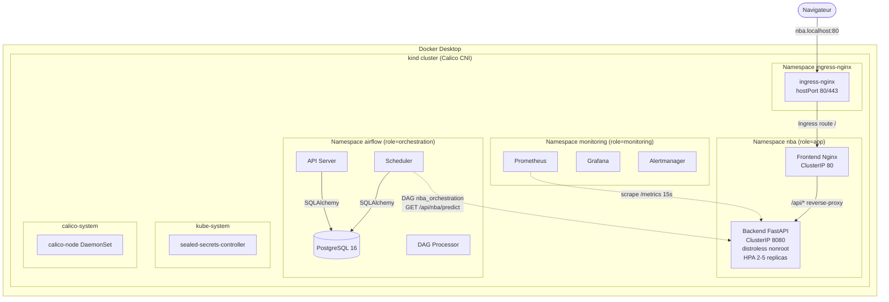
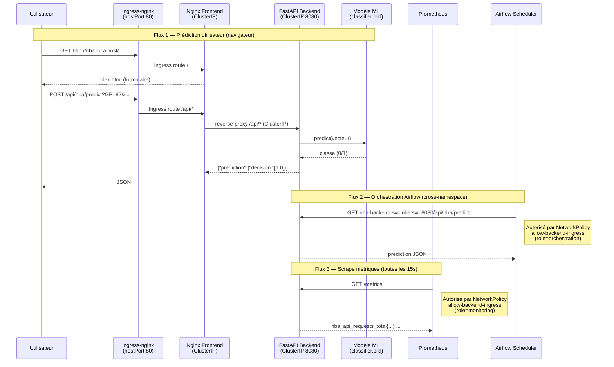
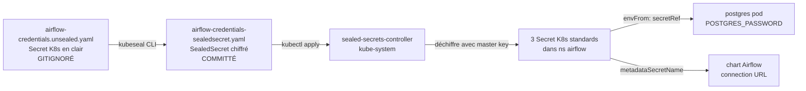
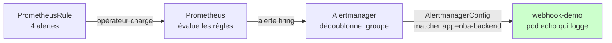

# Documentation technique — NBA Predictor

> Référence approfondie : **pourquoi** chaque choix, **comment** chaque pièce fonctionne, **où** débugger.
> Pour un démarrage en 5 minutes → [README.md](../README.md). Pour reproduire les commandes clés → [key_commands.md](key_commands.md).

---

## Table des matières

- [1. Contexte et auteurs](#1-contexte-et-auteurs)
- [2. Architecture](#2-architecture)
  - [2.1 Vue d'ensemble (3 namespaces)](#21-vue-densemble-3-namespaces)
  - [2.2 Flux de communication](#22-flux-de-communication)
- [3. Stack technique détaillée](#3-stack-technique-détaillée)
- [4. Structure du repository](#4-structure-du-repository)
- [5. Conventions et patterns](#5-conventions-et-patterns)
- [6. Sécurité et résilience (Vague 4)](#6-sécurité-et-résilience-vague-4)
  - [6.1 Image distroless (V4.2)](#61-image-distroless-v42)
  - [6.2 SealedSecrets (V4.1)](#62-sealedsecrets-v41)
  - [6.3 NetworkPolicies + Calico (V4.3)](#63-networkpolicies--calico-v43)
  - [6.4 Trivy et politique `.trivyignore`](#64-trivy-et-politique-trivyignore)
  - [6.5 HorizontalPodAutoscaler + metrics-server (V4.4)](#65-horizontalpodautoscaler--metrics-server-v44)
  - [6.6 Ingress + PodDisruptionBudgets (V4.5)](#66-ingress--poddisruptionbudgets-v45)
- [7. Observabilité avancée (Vague 5)](#7-observabilité-avancée-vague-5)
  - [7.1 Dashboard Grafana versionné](#71-dashboard-grafana-versionné)
  - [7.2 Alerting : PrometheusRule + Alertmanager](#72-alerting--prometheusrule--alertmanager)
- [8. Pipeline d'entraînement ML (Vague 6)](#8-pipeline-dentraînement-ml-vague-6)
  - [8.1 Le fix preprocess() + scaler sérialisé](#81-le-fix-preprocess--scaler-sérialisé)
  - [8.2 Script d'entraînement reproductible + MLflow](#82-script-dentraînement-reproductible--mlflow)
  - [8.3 Serveur MLflow dans le cluster](#83-serveur-mlflow-dans-le-cluster)
- [9. CI/CD GitHub Actions](#9-cicd-github-actions)
- [10. Tests](#10-tests)
- [11. Bugs connus et dette technique](#11-bugs-connus-et-dette-technique)
- [12. Décisions architecturales (mini-ADR)](#12-décisions-architecturales-mini-adr)

---

## 1. Contexte et auteurs

Projet réalisé dans le cadre du cours **"Infrastructures et orchestration de données"** (YNOV, enseignante : Ketsia Mulapi Tita).

- **Application ML d'origine** (modèle de classification de joueurs NBA, API FastAPI, frontend statique) : © Ketsia MULAPI, juin 2021.
- **Partie industrialisation** (conteneurisation, Kubernetes, Airflow, Prometheus/Grafana, CI/CD, sécurité réseau) : © Maël M. ZINSOU, 2026.

Le modèle ML (régression logistique sklearn 0.24.1, sérialisé dans `classifier.pikl`) est **figé** : l'objectif n'est pas le ML mais l'industrialisation. Un pipeline d'entraînement reproductible viendra en Vague 6.

---

## 2. Architecture

### 2.1 Vue d'ensemble (3 namespaces)

L'application tourne sur un cluster Kubernetes local **[kind](https://kind.sigs.k8s.io/)** (Kubernetes-in-Docker), organisé en 3 namespaces isolés :

| Namespace | Composants | Rôle | Label `role=` |
|---|---|---|---|
| `nba` | Frontend Nginx + Backend FastAPI | Application métier | `app` |
| `airflow` | Apache Airflow 2.10.5 (LocalExecutor, Helm chart pinné 1.16.0) + PostgreSQL 16 dédié | Orchestration des appels API | `orchestration` |
| `monitoring` | kube-prometheus-stack (Prometheus + Grafana + Alertmanager + Operator) | Supervision via ServiceMonitor | `monitoring` |

Le label `role=` sur les namespaces permet aux **NetworkPolicies** des autres namespaces de cibler les flux cross-namespace par sélecteur sémantique (voir §6.3).


Le cluster tourne dans Docker Desktop (1 control-plane + 1 worker), avec **Calico** comme CNI pour le support des NetworkPolicies (kindnet, le CNI par défaut, ne les fait pas respecter).



### 2.2 Flux de communication

Trois flux principaux, tous testables :




**Routes API exposées** :
| Méthode | Path | Description |
|---|---|---|
| `GET` | `/` | Healthcheck minimal |
| `GET` | `/api/nba/predict?GP=...&PTS=...&...` | Prédiction depuis 19 stats individuelles |
| `GET` | `/api/nba/info?Name=<nom>` | Prédiction depuis le nom (lookup dans le CSV de référence) |
| `POST` | `/api/nba/dataset` | Prédictions vectorisées sur un CSV uploadé |
| `GET` | `/metrics` | Exposition Prometheus (Counter + Histogram) |
| `GET` | `/docs` | OpenAPI Swagger UI (FastAPI auto-généré) |

---

## 3. Stack technique détaillée

| Composant | Choix | Version | Justification |
|---|---|---|---|
| Conteneurisation | **Docker Desktop** | ≥ 20.10 | Isolation dev/prod, host des conteneurs kind, intégration WSL2 |
| Cluster local | **[kind](https://kind.sigs.k8s.io/)** | ≥ 0.27 | Kubernetes-in-Docker, plus rapide que Minikube, conteneurs visibles dans Docker Desktop |
| Image node kind | `kindest/node:v1.32.2` | pinned SHA | v1.35 a un bug kubeadm/API v1beta3 ([kind#3994](https://github.com/kubernetes-sigs/kind/issues/3994)) |
| CNI | **[Calico](https://www.tigera.io/project-calico/)** via tigera-operator | v3.28.2 | Supporte NetworkPolicies (kindnet par défaut ne les respecte pas) |
| Ingress controller | **[ingress-nginx](https://kubernetes.github.io/ingress-nginx/)** (manifest kind-friendly) | v1.11.3 | Standard de facto, Ingress L7 vers `nba.localhost` (V4.5) |
| Metrics / HPA | **[metrics-server](https://github.com/kubernetes-sigs/metrics-server)** | latest | Requis pour `kubectl top` + HorizontalPodAutoscaler (V4.4) |
| Backend | **FastAPI** + scikit-learn | 0.115.6 / 1.5.1 | Performance async, doc OpenAPI auto, Prometheus client natif |
| Backend image | **`gcr.io/distroless/python3-debian12:nonroot`** | Python 3.11.2 | Pas de shell ni d'apt, UID 65532, surface d'attaque drastiquement réduite |
| Frontend / Reverse proxy | **Nginx** | 1.31 (alpine) | Statique performant, élimine les problèmes CORS, single entry point |
| Orchestration | **Apache Airflow 2.10.5** (Helm, chart pinné 1.16.0) | LocalExecutor | Standard pour DAGs, logs UI ; version 2.x éprouvée (cf. §11.7 sur le pin) |
| Base métadonnées Airflow | **PostgreSQL 16** dédié | image officielle | Robuste, déployé séparément du chart Airflow (subchart instable) |
| Secrets | **Bitnami sealed-secrets** | controller via Helm | SealedSecret committable, déchiffrement côté cluster uniquement |
| Métriques | **Prometheus** (kube-prometheus-stack) | helm chart 85.x | Scraping auto via ServiceMonitor (label `release: kube-prom`) |
| Dashboards | **Grafana** | bundled dans kube-prom | Visualisation infra + métriques métier |
| Sécurité images | **Trivy** (apt install) | latest stable | Scan HIGH/CRITICAL, exit-code 1 + `.trivyignore` documenté |
| Lint Python | **Ruff** (lint + format) | 0.7.4 | Remplace black + isort + flake8, ultra-rapide |
| Type-check Python | **Mypy** | 1.13.0 | Mode strict sur `nba-api/` et `dags/` |
| Tests | **Pytest** + httpx (TestClient) | 8.3.3 | 33 tests (17 unit + 15 intégration FastAPI + 1 xfail strict bug `preprocess()`) |
| CI/CD | **GitHub Actions** | 3 workflows | `ci.yml`, `docker.yml`, `k8s-integration.yml` + Dependabot |
| Pre-commit | **pre-commit hooks** | 4.0.1 | Ruff, yamllint, hadolint, detect-secrets (aligné CI) |

---

## 4. Structure du repository

```
nba_predictor/
├── nba-api/                          # Backend FastAPI + modèle ML
│   ├── app.py                        # Routes FastAPI + métriques Prometheus
│   ├── functions.py                  # Classe NBAPredictor (modèle + preprocessing)
│   ├── requirements.txt              # Pinned : fastapi 0.115.6, sklearn 1.5.1, ...
│   ├── Dockerfile                    # Multi-stage distroless (V4.2)
│   ├── .dockerignore
│   └── static/
│       ├── model/
│       │   ├── classifier.pikl              # Modèle (sklearn 1.5.1, ré-entraîné V6)
│       │   ├── scaler.pikl                   # MinMaxScaler fitté (V6, fix preprocess)
│       │   └── classifier.legacy-0.24.1.pikl # Backup ancien modèle (rollback)
│       └── data/nba_logreg.csv       # Dataset de référence (1340 joueurs)
├── nba-web/                          # Frontend statique
│   ├── index.html                    # Bootstrap + jQuery, chemins relatifs /api/*
│   ├── nginx.conf                    # Reverse-proxy /api/* → nba-backend-svc:8080
│   └── Dockerfile                    # nginx:alpine, static files only
├── k8s/                              # Manifestes Kubernetes (Kustomize)
│   ├── base/                         # Manifestes communs à tous les overlays
│   │   ├── namespace.yaml            # ns nba (labels : role=app, part-of)
│   │   ├── backend-deployment.yaml   # securityContext strict (V4.2) + resources (V4.4)
│   │   ├── backend-service.yaml      # ClusterIP (V4.3+)
│   │   ├── backend-servicemonitor.yaml  # Pour Prometheus (label release: kube-prom)
│   │   ├── backend-hpa.yaml          # V4.4 : HPA CPU 70%, min=2 max=5
│   │   ├── backend-pdb.yaml          # V4.5 : PodDisruptionBudget min=1
│   │   ├── frontend-deployment.yaml
│   │   ├── frontend-service.yaml     # ClusterIP (V4.5+, plus de NodePort)
│   │   ├── frontend-pdb.yaml         # V4.5 : PodDisruptionBudget min=1
│   │   ├── nba-ingress.yaml          # V4.5 : Ingress host nba.localhost
│   │   ├── networkpolicies-nba.yaml          # V4.3 : default-deny + allows
│   │   ├── networkpolicies-airflow.yaml      # V4.3
│   │   ├── networkpolicies-monitoring.yaml   # V4.3
│   │   ├── grafana-dashboard-nba.json        # V5 : dashboard versionné (ConfigMap)
│   │   ├── prometheus-rules-nba.yaml         # V5 : 4 alertes PrometheusRule
│   │   ├── alertmanager-webhook-demo.yaml    # V5 : receiver webhook + AlertmanagerConfig
│   │   ├── airflow-credentials-sealedsecret.yaml  # V4.1 : 3 SealedSecret committés
│   │   └── kustomization.yaml
│   ├── overlays/
│   │   ├── dev/                      # Overlay local
│   │   │   ├── image-pull-policy-never.yaml   # Images chargées via kind load
│   │   │   └── kustomization.yaml
│   │   ├── staging/                  # Stub README pour pré-prod (HPA, Ingress, etc.)
│   │   └── prod/                     # Stub README pour prod managée (GKE/EKS/AKS)
│   ├── secrets/
│   │   └── airflow-credentials.unsealed.yaml  # GITIGNORÉ — source en clair pour kubeseal
│   ├── base/.../networkpolicies-mlflow.yaml   # V6 : NP namespace mlflow
│   ├── kind-config.yaml              # Cluster kind (1 cp + 1 worker, ports 80/443, disableDefaultCNI)
│   ├── calico-installation.yaml      # CR Installation + APIServer pour tigera-operator
│   ├── mlflow.yaml                   # V6 : serveur MLflow (ns + PVC + Deployment + Service)
│   └── airflow-postgres.yaml         # Postgres dédié (envFrom: secretRef SealedSecret)
├── dags/                             # DAGs Airflow
│   └── nba_orchestration.py          # Appel quotidien GET /api/nba/predict
├── training/                         # V6 : pipeline d'entraînement ML
│   ├── train.py                      # Entraînement reproductible + MLflow tracking
│   └── requirements.txt              # mlflow, scikit-learn, pandas, numpy
├── scripts/
│   └── load-test.sh                  # V4.4 : 50 workers x 60s pour démo HPA
├── airflow-values.yaml               # Values Helm (LocalExecutor, metadataSecretName)
├── tests/                            # Suite pytest
│   ├── conftest.py                   # cwd → nba-api/, sys.path injecté
│   ├── test_predictor.py             # 17 tests unit (dont 1 xfail strict bug preprocess)
│   └── test_api.py                   # 15 tests intégration FastAPI TestClient
├── docs/
│   ├── doc.md                        # ← ce fichier
│   ├── key_commands.md               # Cookbook chronologique des commandes
│   ├── PREREQUISITES.md              # Install par OS (Win/macOS/Linux)
│   ├── Rapport projet orchestra nba_predictor.pdf
│   ├── architecture_excalidraw.jpg
│   └── flux_excalidraw.jpg
├── .github/
│   ├── workflows/
│   │   ├── ci.yml                    # 5 jobs parallèles (lint, test, yaml, k8s-validate, hadolint)
│   │   ├── docker.yml                # Build + Trivy --exit-code 1 + SARIF + push GHCR
│   │   └── k8s-integration.yml       # kind + Calico + apply + smoke tests via 30081
│   └── dependabot.yml                # MAJ hebdo, majors pip/docker ignorés (V4.1bis cleanup)
├── Makefile                          # Orchestration (make help pour la liste)
├── pyproject.toml                    # Ruff + Mypy + Pytest config
├── requirements-dev.txt              # Dev/CI deps (ruff, mypy, pytest, pre-commit, etc.)
├── .pre-commit-config.yaml
├── .secrets.baseline                 # detect-secrets : hashes uniquement
├── .trivyignore                      # CVE acceptées avec Revisit by: date
├── .gitignore                        # *.unsealed.yaml, secrets, caches, etc.
├── CLAUDE.md                         # Index + contraintes pour Claude (assistant IA)
├── README.md                         # Vitrine (quickstart, roadmap, liens)
└── LICENSE                           # MIT
```

---

## 5. Conventions et patterns

### 5.1 Workflow images avec kind

```bash
docker build -t nba-backend:1.2 ./nba-api   # build dans Docker Desktop
kind load docker-image nba-backend:1.2 --name nba-predictor  # charge dans containerd des nodes
```

Pas de registry locale. La cible `make build` enchaîne build + load. **`imagePullPolicy: Never`** est appliqué via patch Kustomize dans `k8s/overlays/dev/image-pull-policy-never.yaml` pour garantir qu'aucun pull externe n'est tenté.

### 5.2 Tags d'image en dur

| Image | Tag actuel | Fichier de référence |
|---|---|---|
| `nba-backend` | `1.2` | `k8s/base/backend-deployment.yaml`, `Makefile` (BACKEND_TAG), `.github/workflows/k8s-integration.yml` |
| `nba-frontend` | `1.0` | `k8s/base/frontend-deployment.yaml`, `Makefile` (FRONTEND_TAG), `.github/workflows/k8s-integration.yml` |

Surcharge possible : `make build BACKEND_TAG=2.0`. Penser à bumper le tag aux 3 endroits cités si on bump pour de bon.

### 5.3 Kustomize pour l'app NBA, Helm pour les charts upstream

- L'app NBA est déployée via **Kustomize** : `kubectl apply -k k8s/overlays/dev`.
- Helm est utilisé uniquement pour les charts upstream :
  - `apache-airflow/airflow` (chart officiel)
  - `prometheus-community/kube-prometheus-stack`
  - `sealed-secrets/sealed-secrets` (Bitnami)

Un chart Helm maison pour l'app NBA serait surdimensionné pour 4 manifestes.

### 5.4 CORS volontairement géré côté Nginx (pas FastAPI en prod)

Le frontend appelle toujours des chemins relatifs `/api/*`, jamais `localhost:8080`. Le reverse-proxy nginx fait le bridge vers `nba-backend-svc.nba.svc.cluster.local:8080`. Cela évite de gérer CORS côté FastAPI (même si `CORSMiddleware` est présent pour les appels Postman/curl/DAG).

### 5.5 ServiceMonitor → label `release: kube-prom` obligatoire

Le chart kube-prometheus-stack configure son CR Prometheus avec :
```yaml
serviceMonitorSelector:
  matchLabels:
    release: kube-prom
```
Sans ce label sur le ServiceMonitor, Prometheus ne le scrape pas. C'est le pattern documenté du chart.

### 5.6 PostgreSQL d'Airflow déployé séparément

Le subchart `postgresql` du chart Airflow officiel est instable sur les PVC dans kind. On déploie un Postgres officiel dans un manifest séparé (`k8s/airflow-postgres.yaml`), puis on dit au chart Airflow de pointer dessus via `data.metadataSecretName`.

### 5.7 Accès local : single entry point (V4.3)

Depuis V4.3, **seul le frontend est exposé** (NodePort 30081 mappé sur `localhost:30081`). Le backend est en ClusterIP, accessible uniquement via le reverse-proxy nginx (`localhost:30081/api/*`) ou en interne dans le cluster. Pattern plus proche de la prod (un Ingress unique).

Airflow UI et Grafana → `make port-forward-airflow` (localhost:8081) et `make port-forward-grafana` (localhost:3000).

### 5.8 Métriques Prometheus dans le code

Le backend expose 2 métriques custom dans `nba-api/app.py` :
- `nba_api_requests_total` (Counter, labels: method, endpoint, http_status)
- `nba_api_request_latency_seconds` (Histogram, label: endpoint)

Exposées sur `/metrics`, scrapées toutes les 15s par Prometheus via le ServiceMonitor `nba-backend`.

---

## 6. Sécurité et résilience (Vague 4)

### 6.1 Image distroless (V4.2)

**Objectif** : réduire la surface d'attaque + permettre la réactivation de Trivy `--exit-code 1` dans la CI.

**Pattern multi-stage** dans `nba-api/Dockerfile` :

```dockerfile
# Stage 1 — builder : on a besoin d'un shell + pip
FROM python:3.11-slim AS builder
RUN pip install --no-cache-dir --prefix=/install -r requirements.txt

# Stage 2 — runtime : distroless, pas de shell, pas d'apt
FROM gcr.io/distroless/python3-debian12:nonroot
ENV PYTHONPATH=/install/lib/python3.11/site-packages
COPY --from=builder --chown=nonroot:nonroot /install /install
COPY --chown=nonroot:nonroot . /app
CMD ["-m", "uvicorn", "app:app", "--host", "0.0.0.0", "--port", "8080"]
```

**Points clés** :
- **Python 3.11** dans les 2 stages (cohérence ABI cp311 des wheels numpy/scikit-learn compilées).
- Le `CMD` utilise `-m uvicorn` car l'entrypoint du runtime est `/usr/bin/python3.11` (distroless n'a pas de shell pour résoudre `$PATH` du venv).
- `PYTHONPATH` pointe vers les site-packages copiés depuis le builder.
- Le pickle `classifier.pikl` (sklearn 0.24.1) reste chargeable en sklearn 1.5.1 + Python 3.11 (warning `InconsistentVersionWarning` silencé dans `pyproject.toml`).

**Côté K8s** (`k8s/base/backend-deployment.yaml`), `securityContext` strict aligné PodSecurityStandards "restricted" :
```yaml
securityContext:
  runAsNonRoot: true
  runAsUser: 65532
  fsGroup: 65532
containers:
  - securityContext:
      allowPrivilegeEscalation: false
      capabilities:
        drop: [ALL]
      readOnlyRootFilesystem: true
```

**Résultat** : ~250 CVE OS HIGH/CRITICAL → ~10 (toutes documentées dans `.trivyignore`).

### 6.2 SealedSecrets (V4.1)

**Objectif** : sortir le password Postgres + l'URL SQLAlchemy d'Airflow du repo en clair.

**Workflow** :



**3 SealedSecret générés** :
| Nom | Clé | Consommé par |
|---|---|---|
| `airflow-postgres-secret` | `POSTGRES_PASSWORD` | `Deployment airflow-postgres` via `envFrom: secretRef` |
| `airflow-metadata-secret` | `connection` (URL SQLAlchemy complète) | Chart Airflow via `data.metadataSecretName` |
| `airflow-admin-secret` | `airflow-admin-password` | **Pas encore consommé** (limitation chart : `webserver.defaultUser.password` ne supporte pas un Secret). Préparé pour V4.1bis (customisation `createUserJob.command`). |

**Cycle de vie** :
1. Modifier `k8s/secrets/airflow-credentials.unsealed.yaml` (jamais commité)
2. `make seal-secrets` → regénère `k8s/base/airflow-credentials-sealedsecret.yaml`
3. `git add k8s/base/airflow-credentials-sealedsecret.yaml && git commit`
4. `make apply-sealed-secrets` (auto via `make airflow`) → controller déchiffre → Secrets K8s prêts

**Limite critique** : si on **réinstalle** le controller (master key régénérée — typiquement après `make cluster-down` puis `make all`), tous les SealedSecret committés deviennent indéchiffrables (`no key could decrypt secret`). Le pod `airflow-postgres` reste alors en `CreateContainerConfigError` (`secret not found`) et `make all` échoue à l'étape `airflow`.

**Auto-reseal (depuis le test de reproductibilité du 2026-05-20)** : `make apply-sealed-secrets` (appelé par `make airflow`) détecte ce cas et **re-scelle automatiquement** depuis `k8s/secrets/airflow-credentials.unsealed.yaml` si le fichier est présent et `kubeseal` disponible :
1. apply des SealedSecret committés + attente 20s
2. si un secret reste non déchiffré → re-seal auto avec la clé du controller courant → ré-apply → ré-attente
3. si auto-reseal impossible (kubeseal absent OU fichier unsealed absent) → message explicite + `exit 1`

`make all` redevient ainsi reproductible from-scratch **sur la machine de dev** (qui possède le fichier unsealed gitignoré). Le fichier `airflow-credentials-sealedsecret.yaml` re-scellé est local au cluster ; le committer est optionnel (message le rappelle).

**Pour la portabilité prod / autre machine** : sauvegarder la master key offline et la ré-injecter avant recréation, plutôt que de dépendre du re-seal :
```bash
kubectl get secret -n kube-system -l sealedsecrets.bitnami.com/sealed-secrets-key \
  -o yaml > sealed-secrets-master.key
# À stocker en safe offline (1Password, vault, USB chiffré)
```

### 6.3 NetworkPolicies + Calico (V4.3)

**Objectif** : isolation zero-trust entre les 3 namespaces.

#### Pourquoi Calico ?

**kindnet** (CNI par défaut de kind) ne fait **pas respecter** les NetworkPolicies — elles sont déployées mais ignorées. On bascule sur **Calico** via le tigera-operator :

```yaml
# k8s/kind-config.yaml
networking:
  disableDefaultCNI: true
  podSubnet: "192.168.0.0/16"
```

Sans Calico installé après `kind create cluster`, les nodes restent `NotReady`. La cible `make cluster-up` enchaîne automatiquement avec `make calico-install`.

#### Pattern zero-trust

Chaque namespace applique 3 types de NetworkPolicies :
1. **`default-deny-ingress`** : `podSelector: {}` + `policyTypes: [Ingress]` → bloque tout
2. **`allow-intra-namespace`** : autorise tous les pods du même namespace à communiquer (graphes internes complexes : Airflow notamment)
3. **`allow-<flow>-ingress`** : règles ciblées pour les flux légitimes (cross-namespace via `namespaceSelector` sur label `role=`)

#### Vue d'ensemble des flux autorisés


Tout flux **non listé ci-dessus est bloqué**. Exemples vérifiés :
- ❌ pod dans `default` → `nba-backend-svc:8080` = **timeout** (deny effectif)
- ❌ pod dans `default` → `airflow-postgres:5432` = **timeout** (deny effectif)
- ✓ Airflow scheduler → `nba-backend-svc:8080/api/nba/predict` = `{"prediction":{"decision":[1.0]}}`
- ✓ Prometheus → `nba-backend-svc:8080/metrics` = 2 targets `up`

#### Labels namespace requis

Le `namespaceSelector` des NetworkPolicies cible des labels custom sur les namespaces. Ces labels sont **posés par les cibles Makefile** :
```bash
make nba          # → namespace nba avec role=app (via namespace.yaml dans Kustomize)
make airflow      # → kubectl label namespace airflow role=orchestration --overwrite
make monitoring   # → kubectl label namespace monitoring role=monitoring --overwrite
```

#### Manifests

| Fichier | Namespace | Appliqué par |
|---|---|---|
| `k8s/base/networkpolicies-nba.yaml` | nba | Kustomize (`overlays/dev`) |
| `k8s/base/networkpolicies-airflow.yaml` | airflow | `make airflow` (kubectl apply direct) |
| `k8s/base/networkpolicies-monitoring.yaml` | monitoring | `make monitoring` (kubectl apply direct) |

Les NP airflow et monitoring sont hors Kustomize car leurs namespaces sont créés par Helm (pas Kustomize).

#### Egress : non filtré (V4.3bis prévue)

Pour ce projet, on n'a pas filtré l'egress (le DAG Airflow doit pouvoir appeler `nba-backend-svc.nba.svc.cluster.local` cross-namespace ; sans filtrage egress, c'est OK). Resserrer l'egress (limiter au DNS kube-system + cibler les services autorisés) sera la Vague 4.3bis.

### 6.4 Trivy et politique `.trivyignore`

**Mode** : `--exit-code 1` actif depuis V4.2. Toute nouvelle CVE HIGH/CRITICAL fait fail la CI Docker.

**`.trivyignore` à la racine** : liste explicite des CVE acceptées, avec **date de revisit obligatoire** pour audit trimestriel :

```
# CVE OS distroless (impatchables côté projet, attendent rebuild Google)
# Revisit by: 2026-07-01
CVE-2025-13836  # libpython3.11 stdlib
CVE-2025-8194   # idem
CVE-2026-1299   # idem
CVE-2026-0861   # glibc

# CVE Python deps (fix nécessite bump majeur fastapi)
# Revisit by: 2026-08-01
CVE-2025-62727  # starlette 0.41.3 → 0.49.1 (demande fastapi >=0.117)
```

**Règle absolue** : pas de ligne dans `.trivyignore` sans commentaire `Revisit by:`. Évite l'accumulation silencieuse de dette CVE.

**Installation Trivy** : on l'installe directement via le dépôt apt officiel d'Aqua (pas l'action `aquasecurity/trivy-action` qui a connu 4 incidents — versions inexistantes, deps cassées, install.sh exit 1). Stable et auditable.

### 6.5 HorizontalPodAutoscaler + metrics-server (V4.4)

**Objectif** : adapter automatiquement le nombre de replicas du backend selon la charge CPU.

**Prérequis : metrics-server**
```bash
make metrics-server-install
# = kubectl apply -f https://github.com/kubernetes-sigs/metrics-server/.../components.yaml
#   + patch --kubelet-insecure-tls (kind utilise des certs self-signed)
```

Sans metrics-server, le HPA reste à `<unknown>` et ne scale jamais. `kubectl top nodes / pods` est aussi indisponible.

**Prérequis : `resources` sur le Deployment**

Le HPA calcule un pourcentage par rapport aux `requests`. Sans `requests`, pas de pourcentage, pas de scale. Dans `k8s/base/backend-deployment.yaml` :
```yaml
resources:
  requests:
    cpu: "100m"      # 0.1 CPU = base de calcul %CPU pour HPA
    memory: "256Mi"
  limits:
    cpu: "500m"      # hard cap = 5x requests, pas de noisy neighbor
    memory: "512Mi"
```

Valeurs calibrées après mesure (`kubectl top pods` à l'idle : ~3m CPU, ~145Mi RAM).

**HPA configuration**

```yaml
# k8s/base/backend-hpa.yaml
apiVersion: autoscaling/v2
spec:
  minReplicas: 2     # HA : 1 crash != coupure
  maxReplicas: 5     # limite capacité worker kind
  metrics:
    - type: Resource
      resource:
        name: cpu
        target:
          type: Utilization
          averageUtilization: 70   # trigger à 70% des requests (=70m)
  behavior:
    scaleUp:
      stabilizationWindowSeconds: 30   # rapide
      policies: [{ type: Pods, value: 2, periodSeconds: 30 }]
    scaleDown:
      stabilizationWindowSeconds: 300  # lent (anti-yo-yo)
      policies: [{ type: Pods, value: 1, periodSeconds: 60 }]
```

**Démonstration scale-up** (`make load-test` = 50 workers curl × 60s) :

| Time | CPU % | Replicas | Événement HPA |
|---|---|---|---|
| T+0s (idle) | 3% | 2 | - |
| T+22s | 86% | 2 | >70% threshold |
| T+38s | 97% | **2 → 3** | **scale-up effectif** |
| T+48s | 82% | 3 | stabilisé |
| T+70s (charge off) | 14% | 3 | attente stabilizationWindowSeconds=300 avant -1 |

### 6.6 Ingress + PodDisruptionBudgets (V4.5)

**Objectif** : remplacer le NodePort externe par un vrai Ingress (pattern production-like) + garantir la disponibilité pendant les drains volontaires.

#### Ingress nginx (ingress-nginx)

**Prérequis** : `k8s/kind-config.yaml` doit mapper les ports 80/443 sur l'hôte ET poser le label `ingress-ready=true` sur le control-plane :
```yaml
nodes:
  - role: control-plane
    kubeadmConfigPatches:
      - |
        kind: InitConfiguration
        nodeRegistration:
          kubeletExtraArgs:
            node-labels: "ingress-ready=true"
    extraPortMappings:
      - { containerPort: 80, hostPort: 80, protocol: TCP }
      - { containerPort: 443, hostPort: 443, protocol: TCP }
```

**Install via manifest "kind-friendly" officiel** :
```bash
make ingress-install
# = kubectl apply -f https://raw.githubusercontent.com/kubernetes/ingress-nginx/
#     controller-v1.11.3/deploy/static/provider/kind/deploy.yaml
```

Le manifest configure le controller en `hostPort: 80/443` sur le node labellé `ingress-ready=true`.

**Manifest Ingress** (`k8s/base/nba-ingress.yaml`) :
```yaml
apiVersion: networking.k8s.io/v1
kind: Ingress
metadata:
  name: nba
  namespace: nba
spec:
  ingressClassName: nginx
  rules:
    - host: nba.localhost
      http:
        paths:
          - path: /
            pathType: Prefix
            backend:
              service:
                name: nba-frontend-svc
                port:
                  number: 80
```

Note : `/api/*` continue d'être reverse-proxy par nginx frontend vers le backend (pattern conservé depuis V3, validé). Pas besoin d'une seconde rule Ingress.

**Résolution DNS `nba.localhost`** :
- Linux/macOS : `echo "127.0.0.1 nba.localhost" | sudo tee -a /etc/hosts`
- Windows : éditer `C:\Windows\System32\drivers\etc\hosts` (admin requis)
- Test sans hosts : `curl -H "Host: nba.localhost" http://localhost/...` ou `curl --resolve "nba.localhost:80:127.0.0.1" http://nba.localhost/...`

**Suppression du NodePort frontend** : le frontend repasse en ClusterIP. L'overlay `k8s/overlays/dev/frontend-nodeport.yaml` est supprimé.

#### PodDisruptionBudgets

**Objectif** : pendant un drain volontaire (`kubectl drain node`, upgrade nodes, autoscaler cluster down), garantir un minimum de replicas Ready.

**Backend** (`k8s/base/backend-pdb.yaml`) : `minAvailable: 1` (compatible avec HPA min=2 — 1 pod peut tomber, 1 reste up).

**Frontend** (`k8s/base/frontend-pdb.yaml`) : `minAvailable: 1`. **Limite assumée** : avec `replicas: 1` et `minAvailable: 1`, le pod est non-évictable lors d'un drain volontaire. Acceptable pour ce projet (downtime upgrade tolérable). En prod : `replicas: 2` + `maxUnavailable: 1`.

État observé après déploiement :
```
NAME                              MIN AVAILABLE   MAX UNAVAILABLE   ALLOWED DISRUPTIONS
nba-backend                       1               N/A               1   ← 2 replicas, 1 peut tomber
nba-frontend                      1               N/A               0   ← 1 replica, 0 peut tomber
```

**Limite des PDB** : ils ne protègent que des disruptions **volontaires** (drain API). Pour les disruptions involontaires (crash pod, OOMKill, node down), c'est `replicas` + `readinessProbe` qui jouent.

---

## 7. Observabilité avancée (Vague 5)

L'installation de base (`kube-prometheus-stack`) fournit Prometheus + Grafana + Alertmanager + l'opérateur. La Vague 5 ajoute le **contenu métier** : un dashboard versionné et des alertes spécifiques à l'app NBA.

### 7.1 Dashboard Grafana versionné

**Objectif** : un dashboard NBA défini en Git (source de vérité), pas cliqué à la main dans l'UI (perdu au redéploiement).

**Mécanisme : sidecar auto-discovery**

Le chart Grafana embarque un conteneur sidecar `grafana-sc-dashboard` qui surveille **tous les namespaces** (`NAMESPACE=ALL`) et charge automatiquement tout ConfigMap portant le label `grafana_dashboard: "1"`. Le JSON du dashboard est écrit dans `/tmp/dashboards/` et Grafana le recharge à chaud.

**Workflow** :
```bash
# Le dashboard est un JSON committé : k8s/base/grafana-dashboard-nba.json
# On le transforme en ConfigMap + label (cf. cible make monitoring) :
kubectl create configmap grafana-dashboard-nba -n monitoring \
  --from-file=nba-overview.json=k8s/base/grafana-dashboard-nba.json \
  --dry-run=client -o yaml | kubectl apply -f -
kubectl label configmap grafana-dashboard-nba -n monitoring grafana_dashboard=1 --overwrite
```

**Le dashboard "NBA Predictor — API Overview"** (uid `nba-predictor-api`) contient 5 panels :
| Panel | Type | Query PromQL (résumé) |
|---|---|---|
| Débit requêtes /api (req/s) | timeseries | `sum(rate(nba_api_requests_total[1m])) by (endpoint)` |
| Latence p50/p95/p99 | timeseries | `histogram_quantile(0.95, sum(rate(nba_api_request_latency_seconds_bucket[5m])) by (le, endpoint))` |
| Taux d'erreur 5xx (%) | stat (seuils) | `100 * rate(5xx) / rate(total)` |
| Replicas backend Ready | stat (seuils) | `kube_deployment_status_replicas_ready{deployment="nba-backend"}` |
| Requêtes cumulées par status | timeseries | `sum(nba_api_requests_total) by (http_status)` |

> **Note** : le dashboard utilise une variable `${DS_PROMETHEUS}` de type datasource, donc il fonctionne quel que soit le nom interne de la datasource Prometheus (pas de hardcode d'uid).

### 7.2 Alerting : PrometheusRule + Alertmanager

**Objectif** : être prévenu automatiquement quand l'app dérive (latence, erreurs, indisponibilité).

**Mécanisme** : le CRD `PrometheusRule` (label `release: kube-prom` obligatoire, comme le ServiceMonitor) est chargé par l'opérateur Prometheus. Les alertes "firent" puis sont routées vers Alertmanager.

**4 alertes définies** (`k8s/base/prometheus-rules-nba.yaml`) :
| Alerte | Condition | `for` | Sévérité |
|---|---|---|---|
| `NBABackendHighLatencyP95` | p95 latence > 1s | 2m | warning |
| `NBABackendHighErrorRate` | taux 5xx > 5% | 2m | critical |
| `NBABackendDown` | 0 replica Ready | 1m | critical |
| `NBABackendHPAMaxedOut` | HPA à maxReplicas | 5m | warning |

**Chaîne de routage** :



**Receiver webhook de démo** : pour montrer la chaîne complète sans dépendre d'un Slack/email réel, on déploie un pod `mendhak/http-https-echo` qui logge tout POST reçu. Un `AlertmanagerConfig` (CRD) route les alertes `app=nba-backend` vers ce pod. On lit les alertes reçues dans :
```bash
kubectl logs -n monitoring -l app=alertmanager-webhook-demo -f
```

**Validation effectuée** (en supprimant temporairement le HPA + scale à 0) :
1. `NBABackendDown` passe `pending` → `firing` après ~50s (le `for: 1m`)
2. Alertmanager reçoit l'alerte (`active`, severity critical)
3. Le webhook reçoit la notification `firing`
4. Après restauration (replicas + HPA), le webhook reçoit la notification `resolved` (grâce à `sendResolved: true`)

> **Note d'opération** : le password admin Grafana n'est pas toujours `prom-operator` (il peut être régénéré par le chart). Le récupérer via :
> ```bash
> kubectl get secret kube-prom-grafana -n monitoring -o jsonpath='{.data.admin-password}' | base64 -d
> ```

---

## 8. Pipeline d'entraînement ML (Vague 6)

Le tournant "Data Engineer" du projet : un pipeline d'entraînement **reproductible** qui corrige la dette ML historique et tracke les expériences.

### 8.1 Le fix preprocess() + scaler sérialisé

**Le problème historique** (cf. §11.1) : `preprocess()` faisait un Min-Max **global** sur le vecteur unique (les 19 features mélangées), au lieu d'un scaling **par-feature** fitté sur le dataset. La feature `GP` (50-82) écrasait les autres (0-30). Résultat : `/api/nba/predict` (stats individuelles) et `/api/nba/info` (lookup CSV) pouvaient diverger sur le même joueur.

**Le fix** :
1. `training/train.py` fit un `MinMaxScaler` sur le dataset d'entraînement et le sérialise (`nba-api/static/model/scaler.pikl`).
2. `NBAPredictor.__init__` charge le scaler en plus du modèle.
3. `preprocess()` (désormais méthode d'instance) applique `self.scaler.transform(arr)` — scaling par-feature, cohérent avec l'entraînement.
4. `predict_by_name()` utilise le même scaler (plus de re-fit par requête).

**Invariant critique** : l'ordre des 19 features dans `train.py` (`FEATURE_ORDER`) doit être **identique** à celui de `build_params()` dans `functions.py` (finissant par `TOV`). Le modèle et l'API partagent cet ordre.

**Validation** : les deux routes donnent des résultats identiques (testé 5/5 joueurs). Le test ex-xfail `test_single_vector_uses_dataset_statistics` passe au vert. Suite : 33 passed, 0 xfail.

> **Subtilité** : le scaler est fitté sur un **array numpy** (`df[...].to_numpy()`), pas un DataFrame. Sinon il enregistre `feature_names_in_` et émet un `UserWarning` à chaque `transform` sur array nu (ce que fait l'API). `pyproject.toml` a `filterwarnings = error`, donc ce warning ferait échouer les tests.

### 8.2 Script d'entraînement reproductible + MLflow

`training/train.py` :
- **Reproductible** : `random_state=42`, split train/test 80/20 stratifié. Même dataset → même modèle.
- **Évaluation honnête** : métriques calculées sur le **test set** (20% jamais vus), pas sur le train. Accuracy ~0.72, F1 ~0.79, ROC-AUC ~0.77.
- **MLflow tracking** : params (modèle, max_iter, random_state, n features…), métriques (accuracy/precision/recall/f1/roc_auc), et le modèle loggé comme artefact.

```bash
# Entraînement local (MLflow en mode fichier ./mlruns)
pip install -r training/requirements.txt
python training/train.py

# Vers un serveur MLflow distant
MLFLOW_TRACKING_URI=http://localhost:5000 python training/train.py
```

`mlruns/` est gitignored (les runs ne sont pas committés). Seuls `classifier.pikl` + `scaler.pikl` sont versionnés (l'API en a besoin pour démarrer).

### 8.3 Serveur MLflow dans le cluster

Plutôt que de garder le tracking en local (`mlruns/`), on déploie un **serveur MLflow tracking** dans le cluster (namespace `mlflow`), cohérent avec le reste de l'infra.

**Architecture (volontairement minimaliste pour kind)** :
| Composant | Choix | Pourquoi |
|---|---|---|
| Backend store | SQLite sur PVC (`sqlite:////mlflow/data/mlflow.db`) | Pas de Postgres dédié → économie RAM (budget kind serré) |
| Artifact store | Répertoire local sur le même PVC (`--serve-artifacts`) | Pas de MinIO/S3 |
| Replicas | 1 (`strategy: Recreate`) | SQLite = un seul writer |
| Workers gunicorn | `--workers=1` | Le défaut (4) saturait la limite mémoire (OOMKilled, exit 137) |

> En prod : backend Postgres + artifacts S3/GCS/MinIO + plusieurs replicas. Ici on privilégie la simplicité et la frugalité RAM.

**Déploiement** :
```bash
make mlflow              # namespace + PVC + Deployment + Service + NetworkPolicy
make port-forward-mlflow # http://localhost:5000 (UI)
make train               # entraîne en envoyant le run vers le serveur cluster
```

`make train` exporte `MLFLOW_TRACKING_URI=http://localhost:5000` et lance `training/train.py`. Le run (params, métriques, modèle) est persisté dans le backend SQLite du cluster — visible dans l'UI MLflow (experiment `nba-career-longevity`).

**Piège rencontré (documenté pour mémoire)** : avec la limite mémoire à 512Mi + 4 workers gunicorn (défaut), le pod tombait en `CrashLoopBackOff` (exit code 137 = OOMKilled). Fix : `--workers=1` + limite portée à 768Mi + `timeoutSeconds: 5` sur les probes `/health` (le défaut 1s était trop agressif au boot).

**Limite RAM** : MLflow ajoute ~400-500 Mo au cluster. Sur un kind 8 Go déjà chargé (Calico + Airflow + kube-prom-stack + ingress + app), surveiller `kubectl top nodes`. Si besoin, déployer MLflow à la demande (`make mlflow`) plutôt que dans `make all`.

---

## 9. CI/CD GitHub Actions

### 7.1 Trois workflows

| Workflow | Trigger | Durée | Rôle |
|---|---|---|---|
| `ci.yml` | push, PR | ~3 min | Lint Ruff + Mypy strict + Pytest + yamllint + Kustomize build + hadolint (5 jobs parallèles) |
| `docker.yml` | push paths `nba-api/**`, `nba-web/**` | ~5 min | Build × 2 + Trivy `--exit-code 1` + SARIF upload + push GHCR |
| `k8s-integration.yml` | push paths `k8s/**`, `nba-api/**`, `Makefile` | ~5 min | Crée kind + installe Calico + apply Kustomize + 3 smoke tests via NodePort 30081 |

### 7.2 Décisions clés

**Trivy via apt (pas l'action)** : voir §6.4.

**SARIF upload nécessite 3 permissions** dans `docker.yml` :
```yaml
permissions:
  contents: read
  packages: write          # push GHCR
  security-events: write   # upload SARIF
  actions: read            # ← oubli fréquent, requis par codeql-action/upload-sarif@v3
```

**Repo PUBLIC requis** : GHCR et Code Scanning (onglet Security) sont gratuits **uniquement pour les repos publics**. Sur un repo privé, Code Scanning exige GitHub Advanced Security ($49/user/mois). Le repo nba-predictor reste donc public.

**k8s-integration : tarball workaround pour kind load** :
```yaml
# Sur runner GitHub Actions, `kind load docker-image` échoue avec
# "failed to detect containerd snapshotter" (mismatch containerd
# entre runner et node kind). Workaround : passer par un tarball.
docker save -o /tmp/nba-backend.tar nba-backend:1.2
kind load image-archive /tmp/nba-backend.tar --name nba-predictor
```

**k8s-integration : install Calico avant attendre nodes Ready** :
```yaml
- name: Create kind cluster (CNI disabled, waiting for Calico)
  uses: helm/kind-action@v1.14.0
  with:
    wait: 0s   # ne pas attendre nodes Ready (sans CNI ils ne le seront jamais)
- name: Install Calico
  run: |
    kubectl create -f https://...tigera-operator.yaml
    kubectl apply -f k8s/calico-installation.yaml
    kubectl wait --for=condition=Ready nodes --all --timeout=180s
```

### 7.3 Dependabot

`.github/dependabot.yml` : MAJ hebdo (lundi 8h Paris), groupé par patch/minor.

**Majors IGNORÉS** sur pip/docker : pandas 3, numpy 2, pytest 9, mypy 2, python 3.14 cassent l'app (sklearn pickle 0.24.1, breaking APIs). Bumps majors faits manuellement dans le contexte des Vagues 4-6. Majors github-actions restent autorisés.

---

## 10. Tests

**33 tests pytest** au total, exécutables via `pytest` depuis la racine :

| Fichier | Nb tests | Couvre |
|---|---|---|
| `tests/test_predictor.py` | 18 | Classe `NBAPredictor` : build_params, preprocess (scaler V6), predict_vector, predict_by_name, predict_dataset, edge cases |
| `tests/test_api.py` | 15 | Routes FastAPI via `TestClient` httpx : status codes, schémas, métriques |

**`tests/conftest.py`** : fixture autouse qui chdir vers `nba-api/` (le code utilise des chemins relatifs `static/model/classifier.pikl`) + injecte `nba-api/` dans `sys.path`.

**Coverage** :
```bash
pytest --cov=nba-api --cov-report=term-missing
```

**Historique du test `test_single_vector_uses_dataset_statistics`** : il documentait le bug `preprocess()` en `xfail` strict (V3-V5). Depuis le fix V6 (§8.1), il passe au vert — il vérifie maintenant que le scaling est cohérent quel que soit le `GP`. Suite complète : **33 passed, 0 xfail**.

---

## 11. Bugs connus et dette technique

### 11.1 ~~`preprocess()` Min-Max global cassé~~ — RÉSOLU en V6

**Statut : corrigé (Vague 6).** Avant V6, `preprocess()` (méthode statique) calculait min/max sur les 19 features du vecteur unique, écrasant les features de petite échelle derrière `GP` (50-82). Les prédictions de `/api/nba/predict` divergeaient de `/api/nba/info`.

**Fix** : le pipeline d'entraînement (`training/train.py`) sérialise un `MinMaxScaler` fitté sur le dataset (`scaler.pikl`). `preprocess()` est devenu une méthode d'instance qui applique `self.scaler.transform(arr)` (scaling par-feature). Les deux routes donnent désormais des résultats identiques (validé 5/5). Détails → §8.1.

### 11.2 ~~Modèle ML sklearn 0.24.1 vs runtime 1.5.1~~ — RÉSOLU en V6

**Statut : corrigé (Vague 6).** Le ré-entraînement produit un `classifier.pikl` sérialisé en sklearn 1.5.1, donc plus d'`InconsistentVersionWarning`. L'ancien modèle est archivé en `classifier.legacy-0.24.1.pikl` (rollback). Le filtre `filterwarnings` dans `pyproject.toml` peut être retiré (laissé par sécurité tant que l'ancien pickle traîne en backup).

### 11.3 CVE OS distroless impatchables

Voir `.trivyignore` (§6.4). 4 CVE HIGH dans `libpython3.11`, `glibc` : on attend que Google rebuild l'image distroless. Audit `Revisit by: 2026-07-01`.

### 11.4 Password admin UI Airflow en clair

Le chart Airflow Helm ne supporte pas un Secret pour `webserver.defaultUser.password`. Le password (`admin/admin`) reste en clair dans `airflow-values.yaml`. Le SealedSecret `airflow-admin-secret` existe en prévision (clé prête), mais la consommation demande de customiser `createUserJob.command` — V4.1bis.

### 11.5 Egress NetworkPolicies non filtré

Voir §6.3. V4.3 ne filtre que l'ingress. V4.3bis pour filtrer l'egress (cibler DNS kube-system + services autorisés).

### 11.6 Logs Airflow en `emptyDir` (perdus au restart)

Le chart Airflow demande un PVC ReadWriteMany pour les logs (4 pods qui écrivent). Le provisioner local de kind (`rancher.io/local-path`) ne supporte que ReadWriteOnce → PVC reste `Pending`. On a désactivé `logs.persistence.enabled` (`airflow-values.yaml`), les logs sont en `emptyDir` (perdus au restart du pod). Acceptable pour démo local. Prod : NFS/Longhorn/CSI cloud (EFS/Azure Files/Filestore).

### 11.7 DAG `nba_orchestration` reste `queued` (scheduling KO sur kind local)

**Statut : limite connue, non bloquante pour la démo.** Constaté au test complet du 2026-05-20.

**Symptôme** : un run manuel du DAG (`airflow dags trigger nba_orchestration`) est créé en base (`dag_run` avec `execution_date` renseignée) mais reste indéfiniment en `queued` ; la `TaskInstance` n'est jamais promue `queued → running`. Le scheduler **vit** (heartbeat frais, état `running`, DAG sérialisé en `serialized_dag`, 0 import error) mais sa boucle de scheduling ne loggue aucun envoi à l'executor (`Setting ... to queued` / `Sending ... to executor` absents).

**Ce que ce n'est PAS** : pas un problème de version d'Airflow. Symptôme **identique en Airflow 3.2.0 (chart 1.21) et 2.10.5 (chart 1.16)**. Le downgrade en 2.10.5 (pin actuel) corrige les *deprecation warnings* (`webserver.defaultUser`, composant `webserver`) et fiabilise le déploiement, mais pas le scheduling du DAG.

**Cause probable** : environnement kind contraint. Le pod scheduler tourne **sans `resources` requests/limits** (`resources: {}`), avec le `DagFileProcessor` embarqué (`standalone_dag_processor=False`) sur le même pod ; la boucle critique `_do_scheduling` semble starvée alors que le thread de heartbeat (séparé) répond. Pistes de résolution non explorées (coût/incertitude) : donner des `resources` garanties au scheduler, augmenter `scheduler.parsing_processes`, passer en `standalone_dag_processor=True` (processor dédié), ou tester sur un cluster non-kind.

**Impact démo** : le DAG **se déploie, est détecté, sérialisé, et synchronisé** (`make airflow` exit 0) — il ne s'exécute simplement pas de bout en bout en l'état. L'appel cross-namespace qu'il illustre (`GET /api/nba/predict`) reste démontrable directement via l'API (Ingress) et via le scrape Prometheus. Tout le reste du pipeline (app, HPA, Ingress, monitoring, alertes, MLflow, sealed-secrets reproductibles) fonctionne.

---

## 12. Décisions architecturales (mini-ADR)

### ADR-1 : kind plutôt que Minikube

**Contexte** : il faut un Kubernetes local pour le dev et la CI.

**Options évaluées** :
- Minikube (VM séparée, plus lent au démarrage)
- kind (conteneurs Docker, conteneurs visibles dans Docker Desktop)
- k3d (similaire à kind mais basé sur k3s)

**Décision** : **kind** (Vague 2bis, migration depuis Minikube).

**Justification** : démarrage ~30s vs 2 min, conteneurs cluster visibles dans Docker Desktop (debug visuel), pas de `eval $(minikube docker-env)`, workflow image plus simple (`docker build` + `kind load`). Same containerd que prod, contrairement à k3s.

---

### ADR-2 : Kustomize pour l'app NBA, Helm uniquement pour les charts upstream

**Contexte** : besoin de gérer les manifestes K8s de manière maintenable.

**Options** :
- Tout en Helm (un chart maison pour l'app NBA)
- Tout en Kustomize
- Mix : Kustomize pour l'app, Helm pour les charts upstream

**Décision** : **Mix**. Kustomize pour 4 manifestes maison (overhead Helm injustifié), Helm pour Airflow / kube-prometheus-stack / sealed-secrets (charts upstream complexes).

---

### ADR-3 : PostgreSQL Airflow déployé séparément (pas le subchart)

**Contexte** : le chart Airflow officiel propose un subchart `postgresql`.

**Décision** : déployer un Postgres officiel dans un manifest séparé.

**Justification** : instabilités du subchart sur les PVC dans kind (timeouts au premier provisioning). Découplage qui permet aussi de pointer vers un Postgres managé en prod sans toucher au chart Airflow.

---

### ADR-4 : Distroless plutôt que slim ou alpine (V4.2)

**Contexte** : `python:3.10-slim` traîne ~250 CVE HIGH/CRITICAL upstream impatchables côté projet, ce qui rend impossible la CI Trivy bloquante.

**Options** :
- Rester sur `python:3.10-slim` avec mode warn-only (V3.X)
- Migrer vers `python:3.11-alpine` (musl libc, problèmes possibles avec wheels numpy)
- Migrer vers `gcr.io/distroless/python3-debian12:nonroot` (Python 3.11, glibc)
- Chainguard Wolfi (`cgr.dev/chainguard/python`)

**Décision** : **distroless Google** (Vague 4.2).

**Justification** : compromis taille (424 MB, ~35 MB de moins que slim) + sécurité (pas de shell, pas d'apt, user nonroot par défaut, glibc compatible avec wheels numpy/scikit-learn). Chainguard plus minimal mais écosystème moins connu pour un projet école.

---

### ADR-5 : Bitnami sealed-secrets plutôt que SOPS / external-secrets (V4.1)

**Contexte** : sortir les secrets en dur du repo.

**Options** :
- **SOPS** (chiffrement de fichiers YAML avec age/GPG, déchiffrement local)
- **sealed-secrets** (controller K8s qui déchiffre, public key signing)
- **external-secrets** (sync depuis Vault/AWS Secrets Manager/etc.)

**Décision** : **sealed-secrets** (Vague 4.1).

**Justification** : workflow GitOps-friendly (le SealedSecret committé suffit pour redéployer), pas de dépendance externe (Vault ne tournerait pas en kind), simple à comprendre. SOPS demande de gérer la clé age localement (moins portable entre machines). external-secrets demande un backend externe.

**Limite acceptée** : si on perd la master key du controller, tous les SealedSecret existants sont inutilisables (cf. §6.2 backup).

---

### ADR-6 : Calico CNI plutôt que kindnet par défaut (V4.3)

**Contexte** : besoin de NetworkPolicies pour l'isolation zero-trust.

**Options** :
- kindnet (par défaut, ne respecte pas les NetworkPolicies)
- **Calico** via tigera-operator
- Cilium (plus moderne, observabilité réseau Hubble, mais plus lourd ~500 MB RAM)

**Décision** : **Calico**.

**Justification** : standard de facto pour les NetworkPolicies sur Kubernetes, dataplane Iptables fiable sur kind, install via tigera-operator (1 manifest + 2 CR). Cilium overkill pour ce contexte (Hubble pas utilisé).

---

### ADR-7 : Single entry point via Nginx frontend (V4.3)

**Contexte** : avant V4.3, le backend était exposé en NodePort 30080 et le frontend en NodePort 30081. Après V4.3 avec Calico + NetworkPolicies, l'IP source du trafic externe (SNAT par kube-proxy) est masquée et imprévisible (varie selon Docker Desktop / WSL / Linux natif), rendant un `ipBlock` cible peu fiable.

**Options** :
- Garder NodePort 30080 + autoriser tout sur port 8080 (annule l'isolation)
- Garder NodePort 30080 + tcpdump pour trouver l'IP source vraie + ipBlock précis (fragile)
- **Supprimer NodePort 30080**, tout passer par le frontend nginx (`30081/api/*`)

**Décision** : **option 3** (V4.3).

**Justification** : pattern "single entry point" plus proche d'une vraie prod (Ingress controller unique). Le backend n'est plus accessible que via l'API gateway interne (le frontend nginx ici, un vrai Ingress en V4.5). Résout le problème de NetworkPolicies sans hack.

---

### ADR-8 : Trivy installé via apt plutôt que via l'action GitHub

**Contexte** : 4 incidents consécutifs avec `aquasecurity/trivy-action` (versions inexistantes au registry, dep `setup-trivy@v0.2.2` non publiée, `install.sh exit 1`).

**Décision** : installer Trivy via le dépôt apt officiel d'Aqua dans le workflow `docker.yml`.

**Justification** : 4 lignes shell, stable, auditable, indépendant des releases de l'action. Mantra : « plus important qu'un outil parfait, c'est un outil fonctionnel ».

---

### ADR-9 : HPA CPU-based plutôt que custom metrics (V4.4)

**Contexte** : autoscaler le backend selon la charge réelle.

**Options** :
- HPA basé sur CPU (metrics-server, simple)
- HPA basé sur custom metric `nba_api_requests_total` (Prometheus Adapter, plus précis pour ML)
- KEDA (event-driven, overkill)

**Décision** : **HPA CPU-based** avec threshold 70%.

**Justification** : suffisant pour ce projet (backend FastAPI sync, le CPU est bien corrélé au QPS sklearn). Le custom metric demande Prometheus Adapter (encore un composant à maintenir) sans gain mesurable ici. KEDA pertinent pour des workloads event-driven (Kafka, RabbitMQ), pas pour une API REST.

Calibration : `requests: 100m` calibré après mesure (idle ~3m), threshold 70% = trigger à 70m utilisés (juste au-dessus de la charge typique 1-req/s). Sous load test 50 workers, le pod sature à ~100% des requests, déclenche scale-up jusqu'à `maxReplicas: 5`.

---

### ADR-10 : Ingress nginx + single entry point (V4.5) plutôt que Service LoadBalancer

**Contexte** : exposer le frontend NBA depuis l'extérieur du cluster de manière production-like.

**Options** :
- NodePort 30081 (état V4.3-V4.4)
- Service `type: LoadBalancer` (nécessite MetalLB ou un LB cloud)
- **Ingress nginx** (chart kubernetes/ingress-nginx, kind-friendly)
- Traefik Ingress

**Décision** : **Ingress nginx** (V4.5) avec port mapping kind 80/443 sur l'hôte.

**Justification** : Ingress = abstraction L7 standard Kubernetes. ingress-nginx est le contrôleur de référence (le plus déployé en prod). Le manifest "kind-friendly" officiel évite MetalLB. Pattern "single entry point" plus représentatif d'une vraie prod (un Ingress devant N services, TLS centralisé, WAF, rate-limiting).

**Trade-off** : demande de gérer la résolution DNS `nba.localhost` côté host (entrée `/etc/hosts`), accepté pour ce contexte local. En prod, ce serait une vraie zone DNS pointant vers le LB cloud.

---

### ADR-11 : Dashboard versionné via ConfigMap plutôt que clic UI ou Grafana provisioning natif (V5)

**Contexte** : avoir un dashboard NBA reproductible, en Git.

**Options** :
- Créer le dashboard dans l'UI Grafana (perdu si le pod est recréé sans persistance)
- Provisioning natif Grafana (`provisioning/dashboards/*.yaml` + montage de fichiers)
- **ConfigMap + sidecar auto-discovery** (label `grafana_dashboard=1`)

**Décision** : **ConfigMap + sidecar** (V5).

**Justification** : le chart kube-prometheus-stack embarque déjà le sidecar `grafana-sc-dashboard` qui scanne tous les namespaces. Pas de config Grafana à toucher, pas de volume à monter : on commit un JSON, on en fait un ConfigMap labellé, et le dashboard apparaît. GitOps-friendly, zéro clic manuel, fonctionne en CI.

**Receiver webhook de démo** : pour l'alerting, on route vers un pod echo plutôt qu'un vrai Slack/email afin de démontrer la chaîne complète sans secret externe ni compte tiers. En prod, on remplacerait le `webhookConfigs` par `slackConfigs`/`emailConfigs`/`pagerdutyConfigs` (avec les secrets en SealedSecret, cf. §6.2).

---

### ADR-12 : Ré-entraîner + scaler sérialisé plutôt que patcher preprocess() ou garder le modèle legacy (V6)

**Contexte** : corriger le bug `preprocess()` (Min-Max global sur vecteur unique) sans casser les prédictions.

**Options** :
- Patcher `preprocess()` pour re-fitter un `MinMaxScaler` sur le dataset à chaque requête (ce que faisait `predict_by_name`) — correct mais coûteux et garde le modèle sklearn 0.24.1 non reproductible
- Garder `classifier.pikl` (0.24.1) + ajouter seulement un `scaler.pikl` fitté à part — moins risqué mais conserve l'`InconsistentVersionWarning` et un modèle « boîte noire »
- **Ré-entraîner proprement** (sklearn 1.5.1) avec split train/test reproductible, sérialiser `classifier.pikl` + `scaler.pikl`, charger les deux au démarrage

**Décision** : **ré-entraîner + scaler sérialisé** (V6), avec l'ancien modèle archivé en `classifier.legacy-0.24.1.pikl`.

**Justification** : c'est le vrai geste « Data Engineer ». On obtient un pipeline reproductible (`training/train.py`, `random_state=42`), des métriques honnêtes (évaluées sur test set), un tracking MLflow, et on élimine d'un coup deux dettes (bug preprocess + warning version). Le backup legacy permet un rollback si une régression était détectée.

**Invariant à préserver** : `FEATURE_ORDER` dans `train.py` == ordre de `build_params()` dans `functions.py` (19 features finissant par `TOV`). C'est le contrat implicite entre le modèle et l'API.

---

## Pour aller plus loin

- **Commandes exactes par vague** → [key_commands.md](key_commands.md)
- **Install des outils par OS** → [PREREQUISITES.md](PREREQUISITES.md)
- **Rapport projet (V3)** → [Rapport projet orchestra nba_predictor.pdf](Rapport%20projet%20orchestra%20nba_predictor.pdf)
- **Roadmap des prochaines vagues** → section Roadmap du [README.md](../README.md)
